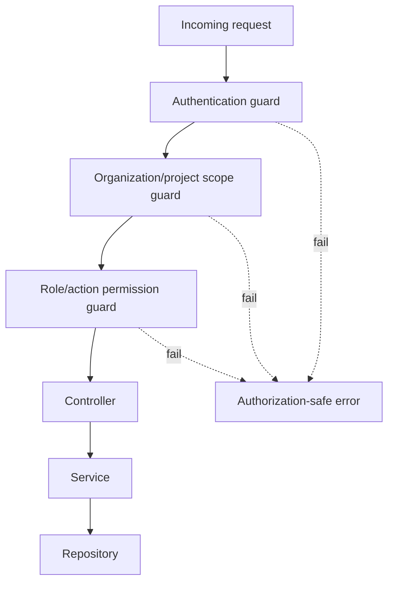

# Auth And RBAC Strategy

Card: OJ-012 - Define auth and RBAC strategy  
Owner: Gabriel Martins  
Role: Backend  
Status: evidence for TechLead review  
Source architecture: `docs/architecture/technical-architecture.md`  
Source requirements: `docs/requirements/functional-requirements-matrix.md`  
Last updated: 2026-07-03

## Decision

Use backend-enforced session authentication with session authentication issued by the NestJS API using secure HttpOnly cookies.

Authorization is role-based with resource scoping by organization and project membership. The frontend may hide unavailable actions, but the backend is the only authority for access decisions.

## Authentication

- Login accepts email/username plus password.
- Passwords are hashed server-side during backend implementation.
- Successful login issues session state through HttpOnly, Secure, SameSite=Lax cookies.
- Protected endpoints require authentication before controller logic.
- Invalid credentials return a generic error.
- Logout invalidates active server-side session or refresh state when present.

## Roles

| Role | Scope | Summary |
| --- | --- | --- |
| `org_admin` | Organization | Manages organization membership, projects, and organization admin actions. |
| `project_admin` | Project | Manages project membership and workflow settings. |
| `member` | Project | Creates, edits, moves, comments, and filters issues. |
| `viewer` | Project | Reads accessible project, board, issue, comment, and audit summary data. |

A user can hold different roles across organizations and projects. Higher roles include lower read permissions only inside the same resource boundary.

## Permission Matrix

| Capability | org_admin | project_admin | member | viewer |
| --- | --- | --- | --- | --- |
| List own organizations | Yes | Yes | Yes | Yes |
| Manage organization members | Yes | No | No | No |
| List accessible projects | Yes | Yes | Yes | Yes |
| Create/manage projects | Yes | No | No | No |
| Manage project members | Yes | Yes | No | No |
| View board | Yes | Yes | Yes | Yes |
| Create issue | Yes | Yes | Yes | No |
| Edit issue fields | Yes | Yes | Yes | No |
| Move issue | Yes | Yes | Yes | No |
| Add comment | Yes | Yes | Yes | No |
| View comments | Yes | Yes | Yes | Yes |
| View audit/history summary | Yes | Yes | Yes | Yes |
| Change workflow columns | Yes | Yes | No | No |

## Enforcement Rules

- Every protected route runs authentication first.
- Organization guards validate membership before organization data is returned.
- Project guards validate membership before project, board, issue, comment, filter, member, or audit data is returned.
- Write guards check action permission before validation or mutation when validation could leak restricted data.
- Restricted and nonexistent resources use authorization-safe responses.
- Controllers do not perform authorization manually; guards and services own enforcement.

## Authorization-Safe Failures

Failures must not reveal restricted names, titles, comments, counts, membership, history, or metadata.

- Anonymous access: 401 or login redirect.
- Authenticated without access: 403 or safe not-found behavior by endpoint policy.
- Invalid credentials: generic failure.
- Unauthorized mutation: no persisted change and no audit side effect except optional security log.

## NestJS Placement

- `AuthModule`: login, session/token strategy, current user extraction.
- `UsersModule`: user lookup and identity helpers.
- `OrganizationsModule`: organization membership boundary.
- `ProjectsModule`: project membership boundary.
- Feature modules: board, issue, comment, filter, and audit action policies.
- Shared guards/decorators: current user, required role/action, resource scope.

## Testing Expectations

- Integration tests cover representative allow/deny cases for each MVP domain.
- E2E tests cover login, protected route denial, project access denial, issue mutation denial, and viewer read-only behavior.
- Test names reference acceptance criteria IDs from `docs/quality/mvp-acceptance-criteria.md`.

## Acceptance Result

OJ-012 is ready for TechLead review.
