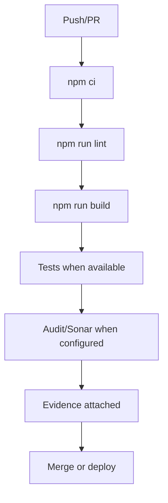

# CI/CD Baseline

Card: OJ-020 - Define CI/CD baseline  
Owner: Camila Rocha  
Role: CI/CD  
Status: evidence for TechLead review  
Source architecture: `docs/architecture/technical-architecture.md`  
Source database strategy: `docs/architecture/local-database-strategy.md`  
Source quality gates: `docs/quality/quality-gates.md`  
Source test policy: `docs/quality/test-pyramid-coverage-policy.md`  
Last updated: 2026-07-03

## Decision

Use GitHub Actions as the CI/CD baseline for frontend, backend, and docs. Branch `main` is production. Branch `development` is integration/evolution.

Docs deploy already uses GitHub Pages from `main`. Frontend and backend remain private until MVP readiness.

## Required Checks

| Repository | Required checks |
| --- | --- |
| `openjira` | `npm ci`, `npm run lint`, `npm run build`, tests/typecheck when introduced |
| `openjira-server` | `npm ci`, `npm run lint`, `npm run build`, runtime audit, integration tests when DB exists |
| `openjira-docs` | `npm ci`, `npm run build`, GitHub Pages deploy on `main` |

## Backend PostgreSQL Integration

CI backend jobs must start PostgreSQL service with `openjira_test`, inject `TEST_DATABASE_URL`, run migrations with `DATABASE_URL=$TEST_DATABASE_URL prisma migrate deploy`, then execute integration tests when introduced.

## Required Branch Strategy

- `development`: active integration branch.
- `main`: production-ready branch.
- Pull requests into `development` require green checks.
- Promotion from `development` to `main` requires TechLead approval and QA evidence.

## Artifacts

- Docs: GitHub Pages artifact from `dist`.
- Frontend/backend: build logs, coverage reports, test reports, and audit summary when configured.
- E2E: traces/screenshots/reports when introduced.

## Secrets

- GitHub tokens and deployment secrets are stored only in GitHub Actions secrets or local `.credentials` for operator use.
- Secrets are never committed or printed.
- Public `openjira-docs` must not include private app secrets or internal credentials.

## Baseline Workflow

## Acceptance Result

OJ-020 is ready for TechLead review.
