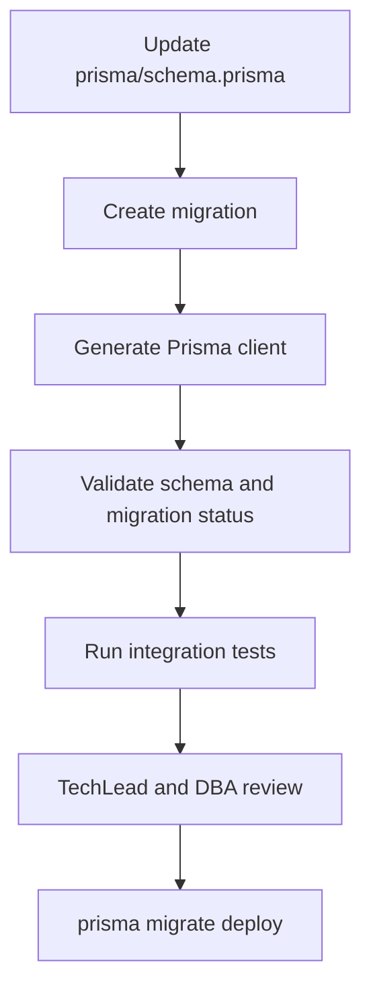

# ORM And Migration Strategy

Card: OJ-011 - Choose ORM and migration strategy  
Owner: Rafael Almeida  
Role: Tech Lead  
Status: evidence for TechLead review  
Source architecture: `docs/architecture/technical-architecture.md`  
Last updated: 2026-07-03

## Decision

Use Prisma as the primary ORM and migration tool for the OpenJira MVP.

Prisma is selected because it gives the team a typed data client, explicit schema ownership, predictable migration files, strong developer ergonomics for NestJS services, and clear CI commands for generation, migration validation, and drift checks.

TypeORM remains a fallback only if a later backend spike proves Prisma blocks a required transaction or query pattern that cannot be handled through Prisma transactions or reviewed raw SQL.

## Comparison

| Criterion | Prisma | TypeORM | Decision impact |
| --- | --- | --- | --- |
| Type safety | Generated typed client from schema | Entity decorators with weaker query typing | Prisma reduces API and repository mismatch risk. |
| Migrations | Explicit migration folders | Flexible migration classes | Prisma is simpler for MVP governance. |
| NestJS integration | Shared `PrismaService` provider | Native repository patterns | Both work; Prisma keeps persistence thin. |
| Schema review | Single `schema.prisma` source | Distributed entity classes | Prisma is easier for TechLead/DBA review. |
| Transactions | Interactive and batch transactions | Transaction manager/query runner | Both acceptable for MVP. |
| Complex SQL | Raw query escape hatch | QueryBuilder is more integrated | TypeORM is stronger here, but MVP does not require it. |
| Testing | Real DB integration tests with generated client | Repository-oriented tests | Prisma favors realistic persistence tests. |

## Migration Strategy

- Keep the Prisma schema in `prisma/schema.prisma` inside `openjira-server`.
- Generate migrations with `prisma migrate dev --name <change>` during local development.
- Commit every migration folder under `prisma/migrations`.
- Apply migrations in deployment/CI with `prisma migrate deploy`.
- Use PostgreSQL as the only MVP database target.
- Require Rafael Almeida and Eduardo Ribeiro review for schema changes.

## Rollback Strategy

- Prefer additive migrations until the data model stabilizes.
- Use forward corrective migrations for reversible production fixes.
- For destructive migration rollback, revert code/migration and restore database backup if the migration reached a persistent environment.
- Destructive migrations require TechLead approval, data-impact notes, and backup evidence.

## Drift Handling

Required checks before merge:

- `npx prisma format --check` or equivalent formatting validation.
- `npx prisma validate`.
- `npx prisma generate`.
- Migration status check against the target database when CI database exists.
- No manual database changes outside migrations.

## Seeds

- Keep seed data minimal and deterministic.
- Use `prisma/seed.ts` for local development, integration tests, and E2E fixtures.
- Do not seed production-like secrets or real user data.

## NestJS Impact

- Add shared `PrismaModule` and `PrismaService`.
- Controllers must not call Prisma directly.
- Transaction boundaries belong in application services for issue create, edit, movement, comments, and audit coupling.
- Repository methods must support authorization-safe response shaping.

## Testing Impact

- Unit tests cover pure validation and policy helpers.
- Integration tests use disposable PostgreSQL with migrations applied.
- Auth, RBAC, issue movement, audit, and filters require real persistence evidence.
- Fixtures should reference acceptance criteria IDs from `docs/quality/mvp-acceptance-criteria.md`.

## Acceptance Result

OJ-011 is ready for TechLead review.
