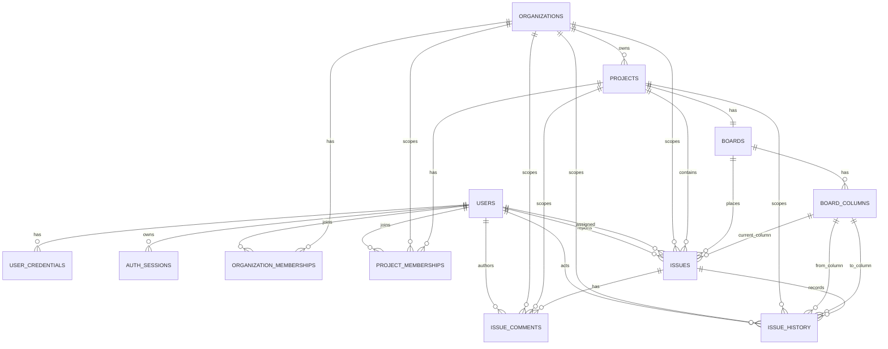

# PostgreSQL MVP Data Model

Card: OJ-013 - Design initial PostgreSQL model  
Owner: Eduardo Ribeiro  
Role: DBA PostgreSQL  
Status: evidence for TechLead review  
Source architecture: `docs/architecture/technical-architecture.md`  
Source ORM strategy: `docs/architecture/orm-migration-strategy.md`  
Source RBAC strategy: `docs/architecture/auth-rbac-strategy.md`  
Last updated: 2026-07-03

## Core Entities

- `users`: user identity.
- `user_credentials`: local credentials separated from identity.
- `auth_sessions`: revocable sessions for HttpOnly cookies.
- `organizations`: tenant boundary.
- `organization_memberships`: user-organization relationship.
- `projects`: projects inside an organization.
- `project_memberships`: user-project relationship and RBAC role.
- `boards`: one MVP board per project.
- `board_columns`: Kanban workflow columns.
- `issues`: work items.
- `issue_comments`: immutable author/date comments.
- `issue_history`: append-only issue audit/history.

## Enums

```sql
organization_role: org_admin, member
project_role: project_admin, member, viewer
issue_type: task, bug, story
issue_priority: low, medium, high, urgent
issue_history_action: created, updated, moved
```

## Relationships

- `organizations` 1:N `projects`.
- `organizations` 1:N `organization_memberships`.
- `users` 1:N `organization_memberships`.
- `projects` 1:N `project_memberships`.
- `users` 1:N `project_memberships`.
- `projects` 1:1 `boards` through `UNIQUE(project_id)`.
- `boards` 1:N `board_columns`.
- `projects` 1:N `issues`.
- `board_columns` 1:N `issues`.
- `issues` 1:N `issue_comments`.
- `issues` 1:N `issue_history`.
- `users` 1:N `issues` as reporter.
- `users` 0:N `issues` as assignee.
- `users` 1:N `issue_comments` as author.
- `users` 1:N `issue_history` as actor.

## Column Standards

- Main tables use `id uuid primary key`.
- Tenant-scoped tables carry `organization_id`.
- Project-scoped tables carry `organization_id` and `project_id`.
- `created_at timestamptz not null default now()`.
- `updated_at timestamptz not null default now()`.
- `deleted_at timestamptz null` when soft-delete is allowed.

## Constraints

```sql
users.email unique where deleted_at is null
organizations.slug unique where deleted_at is null
organization_memberships unique (organization_id, user_id) where deleted_at is null
projects unique (organization_id, key) where deleted_at is null
project_memberships unique (project_id, user_id) where deleted_at is null
boards unique (project_id) where deleted_at is null
board_columns unique (board_id, position) where deleted_at is null
board_columns unique (board_id, key) where deleted_at is null
issues unique (project_id, issue_number)
issues unique (project_id, issue_key)
```

## Cross-Tenant Integrity

- `projects(organization_id, id)` must have a unique index for composite FKs.
- `boards(project_id, id)` must have a unique index.
- `board_columns(board_id, id)` must have a unique index.
- `issues` references `(organization_id, project_id)` in `projects(organization_id, id)`.
- `issues` references `(project_id, board_id)` in `boards(project_id, id)`.
- `issues` references `(board_id, current_column_id)` in `board_columns(board_id, id)`.

This blocks cross-project and cross-board movement at the database layer.

## Cascade And Delete Policy

- `users` must not be physically deleted when authorship, comments, issues, or history exist.
- `organizations`, `projects`, `boards`, `board_columns`, and `issues` use soft-delete.
- `issue_comments` and `issue_history` are append-only for the MVP.

Recommended FK behavior:

| Relation | Delete behavior |
| --- | --- |
| Memberships to users/orgs/projects | `ON DELETE RESTRICT` |
| Projects to organizations | `ON DELETE RESTRICT` |
| Boards to projects | `ON DELETE RESTRICT` |
| Columns to boards | `ON DELETE RESTRICT` |
| Issues to project/board/current column | `ON DELETE RESTRICT` |
| Issues reporter | `ON DELETE RESTRICT` |
| Issues assignee | `ON DELETE SET NULL` |
| Comments/history to issue and user | `ON DELETE RESTRICT` |

## Indexes

Authorization and navigation:

```sql
idx_org_memberships_user_active (user_id, organization_id) where deleted_at is null
idx_project_memberships_user_active (user_id, project_id) where deleted_at is null
idx_projects_org_active (organization_id, name) where deleted_at is null
idx_boards_project_active (project_id) where deleted_at is null
idx_columns_board_position_active (board_id, position) where deleted_at is null
```

Board and filters:

```sql
idx_issues_project_column_active (project_id, current_column_id, rank) where deleted_at is null
idx_issues_project_assignee_active (project_id, assignee_user_id) where deleted_at is null
idx_issues_project_priority_active (project_id, priority) where deleted_at is null
idx_issues_project_type_active (project_id, issue_type) where deleted_at is null
idx_issues_project_key_active (project_id, issue_key) where deleted_at is null
```

Search, comments, and history:

```sql
idx_issues_title_trgm on issues using gin (title gin_trgm_ops) where deleted_at is null
idx_comments_issue_created (issue_id, created_at)
idx_history_issue_created (issue_id, created_at)
idx_history_project_created (project_id, created_at)
```

## Soft-Delete Policy

Soft-delete applies to `users`, `organizations`, `organization_memberships`, `projects`, `project_memberships`, `boards`, `board_columns`, and `issues`.

No soft-delete in MVP: `issue_comments`, `issue_history`, and `auth_sessions`; sessions use `revoked_at` and `expires_at` instead.

Functional queries always filter `deleted_at is null`. Unique constraints must be partial when soft-delete is enabled.

## Multi-Tenant Isolation

Organization is the tenant boundary.

- Every table below organization carries `organization_id`.
- Every table below project carries `organization_id` and `project_id`.
- Repositories filter by `organization_id` and membership before returning data.
- Project access accepts `org_admin` through organization membership or explicit `project_memberships`.
- Issues, comments, and history are never fetched only by `id`; use organization, project, membership, role, and active-state scope.

## Audit

`issue_history` is append-only.

Minimum fields:

```sql
id uuid primary key
organization_id uuid not null
project_id uuid not null
issue_id uuid not null
actor_user_id uuid not null
action issue_history_action not null
field_name text null
old_value jsonb null
new_value jsonb null
from_column_id uuid null
to_column_id uuid null
created_at timestamptz not null default now()
request_id text null
```

Rules:

- Issue creation records `created`.
- Field edit records `updated` with relevant field and values.
- Issue movement records `moved` with source and target columns.
- Authorization failures do not create domain history.
- `issue_comments.author_user_id` and `created_at` are immutable.

## ERD



## Migration Notes For OJ-DB-001

Before OJ-DB-001 implementation, migrations must convert the model rules into valid PostgreSQL DDL:

- Use `CREATE UNIQUE INDEX ... WHERE deleted_at IS NULL` for partial uniqueness.
- Enable `CREATE EXTENSION IF NOT EXISTS pg_trgm` before using `gin_trgm_ops`.
- Add composite FKs for `issue_comments` and `issue_history` using `(organization_id, project_id, issue_id)` so comments/history cannot cross tenant or project boundaries.
- Add supporting unique indexes on `issues(organization_id, project_id, id)`, `projects(organization_id, id)`, `boards(project_id, id)`, and `board_columns(board_id, id)`.
- Keep authorization-sensitive joins scoped by `organization_id`, `project_id`, membership, role, and active-state filters.

## Acceptance Result

OJ-013 is ready for TechLead review.
