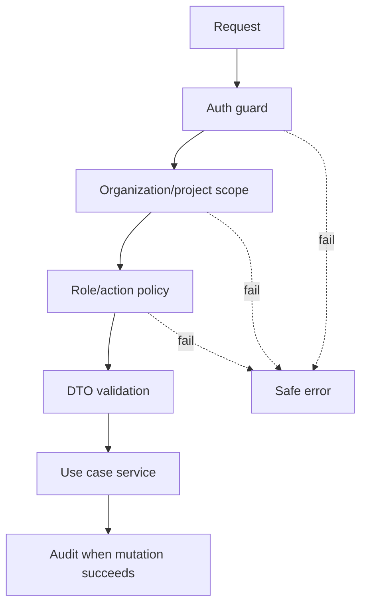

# REST API Contract For MVP

Card: OJ-BE-001 - Define REST API contract for MVP  
Owner: Gabriel Martins  
Role: Backend NestJS / API Contract  
Status: evidence for TechLead review  
Source journeys: `docs/requirements/core-user-journeys.md`  
Source requirements: `docs/requirements/functional-requirements-matrix.md`  
Source architecture: `docs/architecture/technical-architecture.md`  
Source RBAC: `docs/architecture/auth-rbac-strategy.md`  
Source data model: `docs/architecture/postgresql-mvp-data-model.md`  
Last updated: 2026-07-03

## API Principles

- REST JSON API under `/api`.
- Backend enforces auth, RBAC, validation, persistence, and audit.
- Responses are authorization-safe and must not leak restricted names, counts, titles, comments, or metadata.
- OpenAPI/Swagger must be generated from controllers and DTOs.
- Mutating endpoints require session and CSRF protection when cookie auth is implemented.

## Standard Error

```json
{
  "error": {
    "statusCode": 400,
    "code": "VALIDATION_ERROR",
    "message": "Request validation failed.",
    "requestId": "req_123",
    "details": [
      { "field": "title", "message": "Title is required." }
    ]
  }
}
```

Common codes: `UNAUTHENTICATED`, `FORBIDDEN`, `NOT_FOUND`, `VALIDATION_ERROR`, `CONFLICT`, `STALE_STATE`, `INTERNAL_ERROR`.

## Pagination, Sorting And Filtering

List endpoints use query params:

- `limit`: default 25, max 100.
- `cursor`: opaque cursor for pagination.
- `sort`: whitelisted field and direction, for example `createdAt:desc` or `priority:asc`.
- `q`: safe text search where supported.
- Filters must be scoped by organization/project membership before results are returned.
- Unsupported sort/filter fields return `VALIDATION_ERROR` without exposing implementation details.

## Endpoints

### Auth

| Method | Path | Purpose | Auth |
| --- | --- | --- | --- |
| POST | `/api/auth/login` | Create authenticated session | Anonymous |
| POST | `/api/auth/logout` | Revoke current session | Required |
| GET | `/api/auth/me` | Return current user and accessible context | Required |

### Organizations And Projects

| Method | Path | Purpose | Role |
| --- | --- | --- | --- |
| GET | `/api/organizations` | List accessible organizations | Any authenticated user |
| GET | `/api/organizations/:orgId/projects` | List accessible projects | Organization/project member |
| POST | `/api/organizations/:orgId/projects` | Create project | `org_admin` |
| GET | `/api/projects/:projectId` | Project summary | Project member/viewer |
| GET | `/api/projects/:projectId/members` | Project members | `org_admin` or `project_admin` |
| POST | `/api/projects/:projectId/members` | Add project member | `org_admin` or `project_admin` |
| PATCH | `/api/projects/:projectId/members/:userId` | Change project role | `org_admin` or `project_admin` |
| DELETE | `/api/projects/:projectId/members/:userId` | Remove project member | `org_admin` or `project_admin` |

### Board

| Method | Path | Purpose | Role |
| --- | --- | --- | --- |
| GET | `/api/projects/:projectId/board` | Load board columns and visible issues | Project viewer+ |
| GET | `/api/projects/:projectId/columns` | List board columns | Project viewer+ |
| POST | `/api/projects/:projectId/columns` | Create board column | `org_admin` or `project_admin` |
| PATCH | `/api/projects/:projectId/columns/:columnId` | Update board column | `org_admin` or `project_admin` |
| PATCH | `/api/projects/:projectId/columns/reorder` | Reorder board columns | `org_admin` or `project_admin` |
| PATCH | `/api/projects/:projectId/issues/:issueId/move` | Move issue between columns | Project member+ |

Move body:

```json
{
  "targetColumnId": "uuid",
  "afterIssueId": "uuid|null",
  "expectedVersion": 12
}
```

### Issues

| Method | Path | Purpose | Role |
| --- | --- | --- | --- |
| GET | `/api/projects/:projectId/issues` | List/filter issues | Project viewer+ |
| POST | `/api/projects/:projectId/issues` | Create issue | Project member+ |
| GET | `/api/projects/:projectId/issues/:issueId` | Issue detail | Project viewer+ |
| PATCH | `/api/projects/:projectId/issues/:issueId` | Edit issue fields | Project member+ |

Issue filters: `status`, `columnId`, `assigneeId`, `priority`, `type`, `q`.

Create issue body:

```json
{
  "title": "Implement login",
  "description": "Markdown text",
  "type": "task",
  "priority": "medium",
  "assigneeUserId": "uuid|null"
}
```

### Comments And History

| Method | Path | Purpose | Role |
| --- | --- | --- | --- |
| GET | `/api/projects/:projectId/issues/:issueId/comments` | List comments | Project viewer+ |
| POST | `/api/projects/:projectId/issues/:issueId/comments` | Add comment | Project member+ |
| GET | `/api/projects/:projectId/issues/:issueId/history` | List issue history | Project viewer+ |

Comment body:

```json
{ "body": "Looks ready for review." }
```

## Core DTOs

- `UserDto`: `id`, `displayName`, `email` when safe.
- `OrganizationDto`: `id`, `name`, `slug`, `role`.
- `ProjectDto`: `id`, `organizationId`, `name`, `key`, `role`.
- `BoardDto`: `project`, `columns[]`, `issues[]`.
- `IssueSummaryDto`: `id`, `key`, `title`, `type`, `priority`, `status`, `columnId`, `assignee`, `version`.
- `IssueDetailDto`: summary fields plus `description`, `reporter`, `comments`, `history` links.
- `CommentDto`: `id`, `body`, `author`, `createdAt`.
- `HistoryDto`: `id`, `action`, `fieldName`, `oldValue`, `newValue`, `fromColumnId`, `toColumnId`, `actor`, `createdAt`.

## Operation Contract Matrix

| Operation | Request DTO | Success response | Status codes |
| --- | --- | --- | --- |
| `POST /api/auth/login` | `LoginRequest { identifier, password, csrfToken? }` | `AuthSessionDto { user, organizations }` | 200, 400, 401, 403 |
| `POST /api/auth/logout` | none | `EmptyResponse { ok: true }` | 200, 401 |
| `GET /api/auth/me` | none | `CurrentUserDto { user, organizations, projects }` | 200, 401 |
| `GET /api/organizations` | query `limit,cursor,sort` | `Page<OrganizationDto>` | 200, 401 |
| `GET /api/organizations/:orgId/projects` | query `limit,cursor,sort` | `Page<ProjectDto>` | 200, 401, 403, 404 |
| `POST /api/organizations/:orgId/projects` | `CreateProjectRequest { name, key }` | `ProjectDto` | 201, 400, 401, 403, 409 |
| `GET /api/projects/:projectId` | none | `ProjectDto` | 200, 401, 403, 404 |
| `GET /api/projects/:projectId/members` | query `limit,cursor,sort,role` | `Page<ProjectMemberDto>` | 200, 401, 403, 404 |
| `POST /api/projects/:projectId/members` | `AddProjectMemberRequest { userId, role }` | `ProjectMemberDto` | 201, 400, 401, 403, 404, 409 |
| `PATCH /api/projects/:projectId/members/:userId` | `UpdateProjectMemberRequest { role }` | `ProjectMemberDto` | 200, 400, 401, 403, 404 |
| `DELETE /api/projects/:projectId/members/:userId` | none | `EmptyResponse { ok: true }` | 200, 401, 403, 404, 409 |
| `GET /api/projects/:projectId/board` | query filters | `BoardDto` | 200, 401, 403, 404 |
| `GET /api/projects/:projectId/columns` | none | `ColumnDto[]` | 200, 401, 403, 404 |
| `POST /api/projects/:projectId/columns` | `CreateColumnRequest { name, key, position }` | `ColumnDto` | 201, 400, 401, 403, 409 |
| `PATCH /api/projects/:projectId/columns/:columnId` | `UpdateColumnRequest { name?, position? }` | `ColumnDto` | 200, 400, 401, 403, 404, 409 |
| `PATCH /api/projects/:projectId/columns/reorder` | `ReorderColumnsRequest { columnIds }` | `ColumnDto[]` | 200, 400, 401, 403, 404, 409 |
| `GET /api/projects/:projectId/issues` | query `limit,cursor,sort,status,columnId,assigneeId,priority,type,q` | `Page<IssueSummaryDto>` | 200, 400, 401, 403, 404 |
| `POST /api/projects/:projectId/issues` | `CreateIssueRequest` | `IssueDetailDto` | 201, 400, 401, 403, 404 |
| `GET /api/projects/:projectId/issues/:issueId` | none | `IssueDetailDto` | 200, 401, 403, 404 |
| `PATCH /api/projects/:projectId/issues/:issueId` | `UpdateIssueRequest` | `IssueDetailDto` | 200, 400, 401, 403, 404, 409 |
| `PATCH /api/projects/:projectId/issues/:issueId/move` | `MoveIssueRequest` | `IssueSummaryDto` | 200, 400, 401, 403, 404, 409 |
| `GET /api/projects/:projectId/issues/:issueId/comments` | query `limit,cursor,sort` | `Page<CommentDto>` | 200, 401, 403, 404 |
| `POST /api/projects/:projectId/issues/:issueId/comments` | `CreateCommentRequest { body }` | `CommentDto` | 201, 400, 401, 403, 404 |
| `GET /api/projects/:projectId/issues/:issueId/history` | query `limit,cursor,sort` | `Page<HistoryDto>` | 200, 401, 403, 404 |

## Response Shapes

```json
{
  "data": {},
  "meta": {
    "requestId": "req_123"
  }
}
```

Paginated response:

```json
{
  "data": [],
  "pageInfo": {
    "nextCursor": "opaque|null",
    "hasNextPage": false
  },
  "meta": {
    "requestId": "req_123"
  }
}
```

`EmptyResponse`:

```json
{
  "data": { "ok": true },
  "meta": { "requestId": "req_123" }
}
```

## Request DTOs

```ts
type LoginRequest = { identifier: string; password: string; csrfToken?: string };
type CreateProjectRequest = { name: string; key: string };
type AddProjectMemberRequest = { userId: string; role: "project_admin" | "member" | "viewer" };
type UpdateProjectMemberRequest = { role: "project_admin" | "member" | "viewer" };
type CreateColumnRequest = { name: string; key: string; position: number };
type UpdateColumnRequest = { name?: string; position?: number };
type ReorderColumnsRequest = { columnIds: string[] };
type CreateIssueRequest = { title: string; description?: string; type: "task" | "bug" | "story"; priority: "low" | "medium" | "high" | "urgent"; assigneeUserId?: string | null };
type UpdateIssueRequest = Partial<CreateIssueRequest> & { expectedVersion: number };
type MoveIssueRequest = { targetColumnId: string; afterIssueId?: string | null; expectedVersion: number };
type CreateCommentRequest = { body: string };
```

## Response DTOs

```ts
type UserDto = { id: string; displayName: string; email?: string };
type OrganizationDto = { id: string; name: string; slug: string; role: "org_admin" | "member" };
type ProjectDto = { id: string; organizationId: string; name: string; key: string; role: "project_admin" | "member" | "viewer" };
type ProjectMemberDto = { user: UserDto; role: "project_admin" | "member" | "viewer" };
type ColumnDto = { id: string; key: string; name: string; position: number };
type IssueSummaryDto = { id: string; key: string; title: string; type: string; priority: string; status: string; columnId: string; assignee: UserDto | null; version: number };
type BoardDto = { project: ProjectDto; columns: ColumnDto[]; issues: IssueSummaryDto[] };
type IssueDetailDto = IssueSummaryDto & { description?: string; reporter: UserDto; comments?: CommentDto[]; history?: HistoryDto[] };
type CommentDto = { id: string; body: string; author: UserDto; createdAt: string };
type HistoryDto = { id: string; action: string; fieldName?: string; oldValue?: unknown; newValue?: unknown; fromColumnId?: string; toColumnId?: string; actor: UserDto; createdAt: string };
```

## RBAC Enforcement



## Audit Rules

- Issue create records `created`.
- Issue edit records `updated` for changed fields.
- Issue movement records `moved` with source/target columns.
- Comment creation does not rewrite comment author/time.
- Failed authorization does not create domain audit records.

## OpenAPI Draft

OJ-BE-001 defines the draft OpenAPI contract to be implemented by controllers and DTOs. OJ-BE-002 will expose the generated Swagger UI and JSON.

Minimum OpenAPI groups:

- `Auth`: login, logout, current user.
- `Organizations`: accessible organizations.
- `Projects`: project listing, detail, and member management.
- `Board`: board load, columns, column reorder, issue movement.
- `Issues`: list, create, detail, edit.
- `Comments`: list and create comments.
- `History`: issue history.

Every operation must declare auth requirement, RBAC role, request DTO, response DTO, standard error responses, and authorization-safe failure semantics.

## Acceptance Result

OJ-BE-001 is ready for TechLead review.
