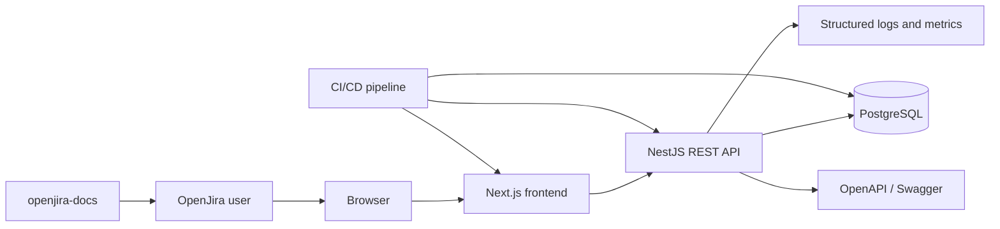
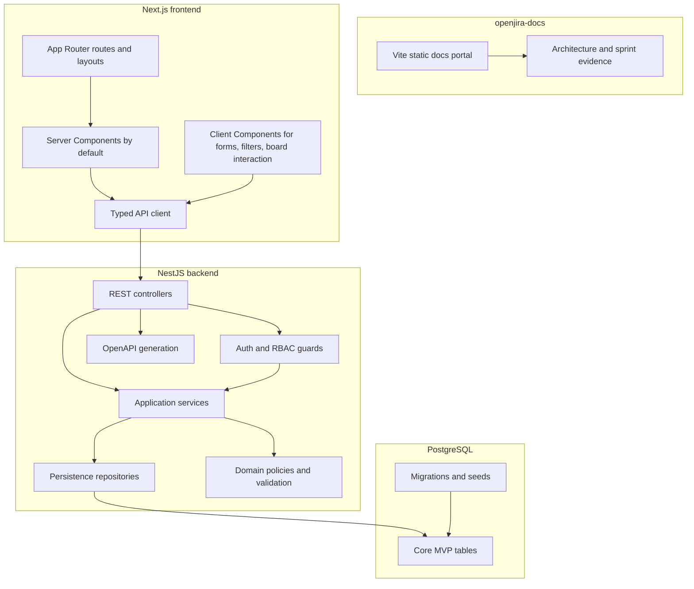
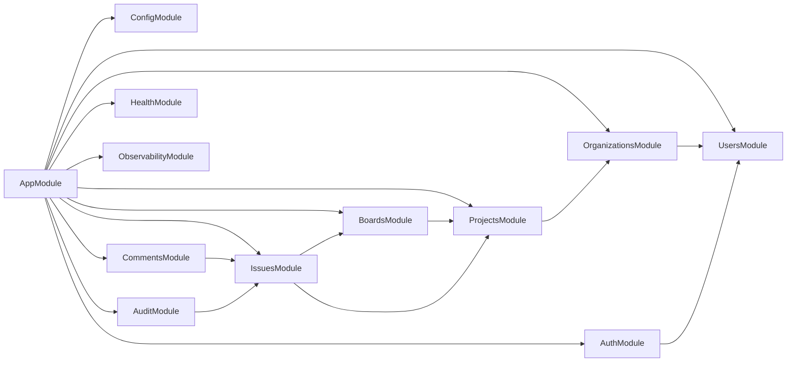
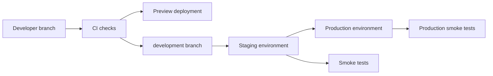
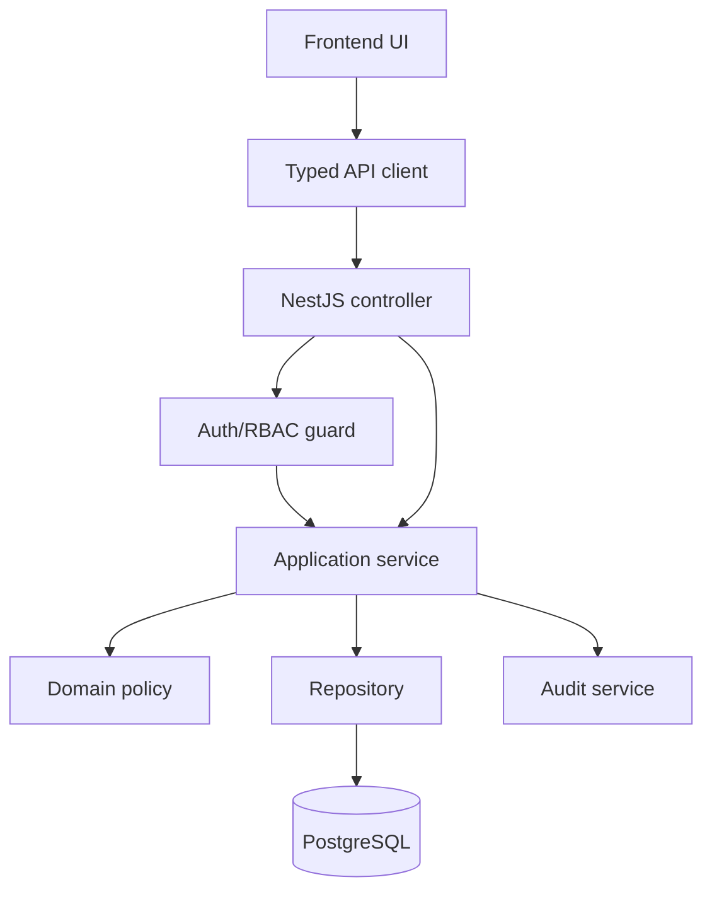

# OpenJira Technical Architecture

Card: OJ-010 - Define technical architecture  
Epic: OJ-E04 - Architecture And Technical Decisions  
Owner: Rafael Almeida  
Role: Tech Lead  
Status: evidence for TechLead review  
Source journeys: `docs/requirements/core-user-journeys.md`  
Source requirements: `docs/requirements/functional-requirements-matrix.md`  
Source backlog: `docs/product/mvp-backlog.md`  
Source sprint plan: `docs/sprints/sprint-000-plan.md`  
Last updated: 2026-07-02

## Purpose

Define the technical architecture required to implement the OpenJira MVP without expanding scope beyond the approved user journeys and functional requirements matrix.

This document is an architecture baseline. It unlocks downstream architecture, backend, database, API, scaffold, and CI/CD cards, but it does not replace their detailed outputs.

## MVP Scope Guardrails

The architecture covers only the MVP domains approved in `OJ-008`:

- Auth.
- Organizations.
- Members.
- Projects.
- Boards.
- Issues.
- Comments.
- Filters.
- Permissions.
- Audit.

The following remain post-MVP or out of scope unless a future backlog card reopens them:

- Notifications.
- Custom workflows beyond the initial small Kanban workflow.
- Multiple boards per project.
- Attachments, labels, subtasks, linked issues, estimates, due dates, and advanced issue templates.
- Saved filters, shared filters, global search, and advanced search syntax.
- Custom permission schemes and field-level permissions.
- Exportable audit logs and compliance reporting.

## Architecture Principles

- Backend is the source of truth for authorization, validation, persistence, and audit.
- Frontend may hide unavailable actions, but it must never be trusted for enforcement.
- API responses must be authorization-safe and must not leak restricted names, issue titles, comments, counts, or metadata.
- The MVP must stay modular enough for Sprint 001 through Sprint 004 without adding cross-module shortcuts.
- Runtime dependencies flow inward: UI and controllers call application services; services coordinate domain rules and repositories; repositories own persistence access.
- Documentation and evidence must remain Markdown-first in `openjira-docs`.

## System Context



## Container View



## Frontend Architecture

Target: Next.js 16.2.10 with App Router in the frontend repository.

### App Shell

The authenticated app shell must provide:

- Session-aware layout.
- Organization and project context.
- Primary navigation for project selection, board, issue detail, and account/session states.
- Empty, loading, error, unauthorized, forbidden, not found, and session-expired states.
- Responsive behavior that keeps the board usable on desktop and provides status navigation or stacked views on smaller screens.

The app shell is a product UI concern and remains distinct from the `openjira-docs` Manager View.

### Route Map Baseline

OJ-FE-001 must refine this route map, but OJ-010 establishes the first architecture direction:

| Route | Purpose | Auth | Primary data |
| --- | --- | --- | --- |
| `/login` | Authenticate user | anonymous only when unauthenticated | login result |
| `/app` | Resolve first accessible organization or project | required | current user, organizations |
| `/app/orgs` | Organization selection | required | accessible organizations |
| `/app/orgs/[orgId]/projects` | Project selection | required | accessible projects |
| `/app/orgs/[orgId]/projects/[projectId]/board` | Project board | required | board, columns, issues, filters |
| `/app/orgs/[orgId]/projects/[projectId]/issues/[issueId]` | Issue detail | required | issue detail, comments, history |
| `/403` | Authorization-safe forbidden state | contextual | none or safe context |
| `/404` | Not found state | contextual | none or safe context |

### State Boundaries

- Server Components should be the default for route-level data loading and stable layout composition.
- Client Components are allowed for login form state, filter controls, issue create/edit forms, comment form, drag/drop or keyboard movement, optimistic board updates, and drawer/modal interaction.
- URL state should hold board filters where it improves shareability and refresh behavior.
- Local component state should hold transient form input, pending UI state, and optimistic board movement.
- Backend responses remain authoritative after mutation. Optimistic UI must roll back on failed movement, edit, comment, or create actions.

### Data Fetching

- The frontend must use a typed API client layer rather than scattering `fetch` calls through components.
- Route-level loading should call backend REST endpoints through the API client.
- Mutations must handle standard API errors and map validation details to field-level UI errors where safe.
- Forbidden and not-found states must avoid rendering restricted names or metadata.
- Frontend mocks, when needed, must follow the future REST response shape from `OJ-BE-001`.

### UI Boundaries

Frontend components should be grouped by workflow boundary:

- `auth`: login and session states.
- `app-shell`: navigation, organization/project context, route guards.
- `organizations`: organization selection.
- `projects`: project selection.
- `board`: board, columns, cards, filters, movement controls.
- `issues`: create, detail, edit, comments, history summary.
- `shared`: badges, empty states, error states, buttons, forms.

No component should contain direct backend authorization logic beyond hiding or disabling actions based on server-provided permissions.

## Backend Architecture

Target: NestJS backend in `~/projects/javascript/nestjs/openjira-server`.

### Module Boundaries



Recommended initial modules:

| Module | Owns | Must not own |
| --- | --- | --- |
| `ConfigModule` | Environment validation, app config, database config, auth config | Domain logic |
| `AuthModule` | Login, password verification, session/token strategy, current user | Project authorization rules |
| `UsersModule` | User lookup and identity helpers | Membership policy ownership |
| `OrganizationsModule` | Accessible organizations, organization membership boundary | Project board behavior |
| `ProjectsModule` | Accessible projects and project membership boundary | Board movement or issue persistence |
| `BoardsModule` | Board loading, columns, issue placement, movement orchestration | Comment content rules |
| `IssuesModule` | Issue create, detail, edit, field validation, issue status data | Auth token handling |
| `CommentsModule` | Comment create/list and validation | Issue movement |
| `AuditModule` | Issue history and immutable audit records | Authorization decisions |
| `HealthModule` | Liveness and readiness | Business behavior |
| `ObservabilityModule` | Request id, logs, metrics hooks | Domain persistence |

### Backend Layers

Each feature module should use these layers:

- Controller: HTTP transport, route params, request DTO binding, response DTO mapping.
- Guard/policy: authentication and authorization checks before protected reads or writes.
- Service: application use case orchestration and transaction boundaries.
- Domain policy/helper: reusable business checks such as movement validity or assignee eligibility.
- Repository: persistence reads/writes, query constraints, and transaction participation.
- DTO/schema: input validation and output shaping.

Controllers must not call repositories directly. Repositories must not return unrestricted data to controllers without service-level authorization and response shaping.

### Guards And Authorization

- Authentication guard identifies the current user for every protected endpoint.
- RBAC and membership guards must be backend-enforced.
- Resource authorization must check organization membership, project membership, and action permission before exposing data.
- Authorization failure must return an authorization-safe response and must not leak whether a restricted resource exists.
- OJ-012 owns the final permission matrix, but this architecture requires backend enforcement for all protected reads and writes.

### Validation

- Global validation pipe should reject unknown or invalid fields for DTOs.
- Validation errors must be normalized into the standard API error format.
- Field-level validation details may be returned only when they do not expose restricted data.
- Create/edit/comment/filter endpoints must validate inputs before mutation.

### Transactions

Transactions are required for:

- Issue movement with board ordering or column update.
- Issue create plus initial history record.
- Issue edit plus history record.
- Comment create when audit/event coupling is introduced.

OJ-011 owns ORM and migration details. OJ-013 owns final schema design.

## API Strategy

REST is the MVP API style.

### Endpoint Groups

OJ-BE-001 must produce the final endpoint matrix. This architecture establishes the groups:

- Auth: login, logout/session invalidation if used, current user.
- Organizations: list accessible organizations.
- Members: list eligible members for project assignment and role context.
- Projects: list accessible projects for an organization.
- Boards: load board, columns, visible issues, move issue.
- Issues: create, detail, update.
- Comments: list comments, create comment.
- History: list issue history as part of issue detail or separate issue sub-resource.
- Filters: board query parameters for status/column, assignee, priority, type, and text.
- Health: liveness and readiness.

### DTO And Response Rules

- Request DTOs must be explicit and validated.
- Response DTOs must expose only fields safe for the authenticated user.
- List endpoints must avoid leaking restricted counts or metadata.
- Board responses should return a project board aggregate: board, columns, visible issue cards, available filter options when safe, and user permissions for UI affordances.
- Issue detail responses should include comments and basic history only after issue access is confirmed.

### Standard Error Shape

OJ-BE-001 must standardize this shape:

```json
{
  "statusCode": 400,
  "code": "VALIDATION_ERROR",
  "message": "Request validation failed.",
  "requestId": "req_...",
  "details": []
}
```

Rules:

- `message` must be safe for user display.
- `details` must never reveal restricted identifiers or metadata.
- `requestId` must be present for operational tracing.
- Authentication failures use safe 401 responses.
- Authorization and restricted not-found cases should prefer safe 403 or 404 behavior according to OJ-012/OJ-BE-001, but both must avoid leakage.

### Pagination, Sorting, And Filtering

- Board MVP can load project-scoped visible issue cards in one board aggregate if dataset size is bounded for MVP.
- Filters are project-board scoped and apply only after authorization.
- Text search is limited to visible issue key or title.
- Comments and history can use pagination if needed by OJ-BE-001.

## Database Strategy At Architecture Level

Target database: PostgreSQL.

This section defines architecture constraints only. OJ-013 owns the final ERD, columns, indexes, constraints, cascade behavior, soft-delete policy, and tenant isolation details. OJ-011 owns ORM and migration strategy.

### Core Entities

Expected MVP entities:

- User.
- Organization.
- Organization membership.
- Project.
- Project role binding or project membership.
- Board.
- Board column.
- Issue.
- Issue comment.
- Issue history.

### Tenancy And Isolation

- Organization is the tenant boundary for MVP.
- Project belongs to one organization.
- Board belongs to one project.
- Issue belongs to one project and one board column.
- Comment and history belong to one issue.
- Every query for project, board, issue, comment, and history must be constrained by accessible organization/project membership before data leaves the backend.
- Tenant and project identifiers should be present where they simplify safe filtering and indexing, but OJ-013 owns final denormalization choices.

### Integrity Requirements

- Membership uniqueness must prevent duplicate membership bindings.
- Board columns must belong to the same board as the issue being moved.
- Issue movement must not allow cross-project or cross-board column assignment.
- Comment author and creation time are immutable.
- Issue history must preserve actor, action, affected issue, changed field or movement, and timestamp.

### Index Candidates

OJ-013 should evaluate indexes for:

- Organization membership lookup by user.
- Project membership lookup by user and organization/project.
- Board lookup by project.
- Issue lookup by project, board column, status, assignee, priority, type, and text key/title search.
- Comment lookup by issue.
- History lookup by issue.

## CI/CD, Deployment, And Observability Architecture

This section defines architecture direction. OJ-020 owns the CI/CD baseline. OJ-022 and OJ-024 own SonarQube and required checks when access exists. OJ-005 remains blocked by hosting/repository/secrets.

### CI/CD Direction

The minimum architecture requires pipelines for:

- Frontend install, lint, typecheck, tests when available, and build.
- Backend install, lint, typecheck/build, unit tests, integration tests when database is available, and Swagger/OpenAPI generation validation.
- Database migration validation after OJ-011/OJ-013/OJ-014 define details.
- Docs build for `openjira-docs`.
- Artifact capture for build output, test results, and evidence links.

### Deployment Topology



MVP deployment target assumptions:

- Frontend deploys as a Next.js application to the selected hosting target.
- Backend deploys as a Node.js service with access to PostgreSQL.
- Database migrations run as controlled deployment steps, not from arbitrary request handlers.
- Docs deploy independently as a static site.

### Observability

The architecture requires:

- Request id generated or propagated per request.
- Structured logs with method, route, status, duration, user id when safe, organization/project context when safe, and request id.
- Health endpoints:
  - `/health/live` does not require database.
  - `/health/ready` validates database connectivity and critical dependencies.
- Error responses include request id.
- Metrics should cover request latency, error rate, database readiness, and auth/authorization failure rates without logging secrets or sensitive payloads.

## Dependency Direction And Module Boundaries

### Runtime Direction



Rules:

- UI does not import backend code.
- API client does not know database or ORM details.
- Controllers do not own business rules.
- Guards and services own authorization enforcement.
- Services own transaction boundaries.
- Repositories own persistence queries only.
- Audit is written by services as part of use cases, not by controllers.

### Repository Boundaries

- `openjira-docs`: product, workflow, sprint, architecture, quality, and evidence documentation.
- Next.js frontend repository: user-facing application UI only.
- NestJS backend repository: REST API, domain services, auth, RBAC, validation, persistence integration, observability.
- Database schema and migrations live with backend unless OJ-011 chooses a separate migration package.

## Architecture Decisions

| Decision ID | Decision | Rationale | Downstream owner |
| --- | --- | --- | --- |
| ADR-010-001 | Use Next.js App Router for the frontend application. | Aligns with current project shape and supports route-level layouts, server-first rendering, and client islands for interactive board/forms. | Lucas Ferreira / OJ-017 / OJ-FE-001 |
| ADR-010-002 | Use NestJS as the backend REST API framework. | Matches backend target and provides module, guard, DTO, validation, controller, and service boundaries for the MVP. | Gabriel Martins / OJ-015 |
| ADR-010-003 | Use REST as the MVP API style. | Requirements map cleanly to resources and OpenAPI/Swagger can drive frontend mocks and integration tests. | Gabriel Martins / OJ-BE-001 |
| ADR-010-004 | Use PostgreSQL as the system of record. | Required for relational tenancy, memberships, board/issue relationships, transactional movement, comments, and audit history. | Eduardo Ribeiro / OJ-013 |
| ADR-010-005 | Enforce authorization only on the backend. | Frontend hints improve UX but cannot protect data. Backend must prevent leakage for restricted resources and counts. | Gabriel Martins / OJ-012 |
| ADR-010-006 | Keep issue movement transactional. | Board state, column assignment, ordering, and history must remain consistent on valid and stale movement attempts. | OJ-011 / OJ-013 / OJ-BE-004 |
| ADR-010-007 | Keep docs static and independent. | Documentation must remain available without application runtime, database, or backend dependencies. | Sofia Mendes / Camila Rocha |
| ADR-010-008 | Defer notification architecture. | Notifications are explicitly out of scope for MVP and must not affect API, database, or UI delivery. | Mariana Costa |

## Handoff To Downstream Cards

### OJ-011 - Choose ORM And Migration Strategy

Unlocked by this architecture.

OJ-011 must:

- Compare Prisma and TypeORM against NestJS module boundaries, transaction needs, migration reliability, rollback, drift validation, seed strategy, PostgreSQL support, and test ergonomics.
- Recommend one ORM.
- Define migration commands, rollback approach, drift checks, and seed lifecycle.
- Explain impact on repositories, transaction boundaries, integration tests, and CI.

### OJ-012 - Define Auth And RBAC Strategy

Unlocked by this architecture and OJ-008.

OJ-012 must:

- Select the authentication approach.
- Define `org_admin`, `project_admin`, `member`, and `viewer`, unless an ADR justifies a different set.
- Map every protected read/write action to backend-enforced authorization.
- Define safe 401, 403, and restricted not-found behavior.
- Define permission matrix for organizations, projects, boards, issues, comments, filters, memberships, and audit/history.

### OJ-013 - Design Initial PostgreSQL Model

Still waits for OJ-011 and OJ-012.

OJ-013 must:

- Produce the ERD for the core MVP entities.
- Define relationships, constraints, FKs, enums/domains, cascade behavior, soft-delete policy, tenant isolation, indexes, and audit requirements.
- Ensure the model supports issue movement, comments, basic history, project-scoped filters, and membership boundaries.

### OJ-BE-001 - Define REST API Contract For MVP

Still waits for OJ-013 after this architecture.

OJ-BE-001 must:

- Publish endpoint matrix and OpenAPI/Swagger draft.
- Define DTOs, response shapes, standard errors, pagination, sorting, filtering, auth requirements, and RBAC requirements per endpoint.
- Ensure API behavior supports acceptance criteria from OJ-009 and authorization rules from OJ-012.

### OJ-015 - Scaffold openjira-server

Unlocked by this architecture after TechLead acceptance.

OJ-015 must:

- Create the NestJS backend project at `~/projects/javascript/nestjs/openjira-server`.
- Include baseline module structure compatible with this architecture.
- Include health endpoint, lint, build, and minimal validation path.
- Avoid implementing MVP feature logic before OJ-011, OJ-012, OJ-013, and OJ-BE-001 provide detailed decisions.

### OJ-020 - Define CI/CD Baseline

Partially informed by this architecture but still waits for OJ-014, OJ-019, and OJ-023.

OJ-020 must:

- Convert the architecture validation needs into concrete CI jobs.
- Define frontend, backend, docs, database, migration, test, artifact, and deploy checks.
- Avoid depending on unavailable hosting, repository, or secret access until Infra provides them.

## Quality And Validation Expectations

This architecture enables automated validation by requiring:

- Lint and build for frontend, backend, and docs.
- Typecheck once scripts exist.
- Unit tests for services, policies, guards, and DTO validation.
- Integration tests for API, database, authorization, migrations, and issue movement.
- E2E tests for login, organization/project selection, board loading, issue create/detail/edit, comments, movement, filters, and permission failures once UI and backend exist.
- Evidence documents for tester, QA, SonarQube, deploy, and release decisions.

## Risks And Open Decisions

| Risk or open decision | Owner card | Current architecture position |
| --- | --- | --- |
| ORM choice can affect migration reliability and transaction implementation. | OJ-011 | Keep repository interfaces and service transaction boundaries explicit. |
| Auth/session strategy affects frontend routing and API guard implementation. | OJ-012 | Backend-enforced auth is required; final token/session mechanism remains open. |
| Database model can affect tenant isolation and filter safety. | OJ-013 | Organization/project membership boundaries must constrain every protected query. |
| CI/CD cannot be fully implemented without repo, hosting, and secret access. | OJ-020 / OJ-005 | Define baseline now; execute access-dependent setup only after Infra unblocks. |
| SonarQube and required checks require external access. | OJ-022 / OJ-024 | Keep quality gate architecture ready, but do not block OJ-010 on access. |

## Readiness Assessment

OJ-010 has defined:

- Frontend architecture.
- Backend architecture.
- REST API strategy.
- PostgreSQL architecture constraints.
- CI/CD, deployment, and observability direction.
- Dependency direction and module boundaries.
- Mermaid context, container, deployment, module, and runtime diagrams.
- Explicit ADR-style decisions for stack and major boundaries.
- Handoffs to OJ-011, OJ-012, OJ-013, OJ-BE-001, OJ-015, and OJ-020.

This evidence does not change card statuses. It is ready for TechLead acceptance review.
