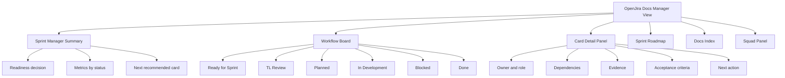
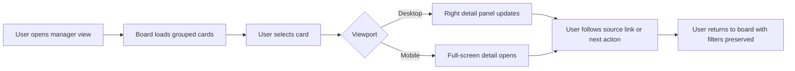
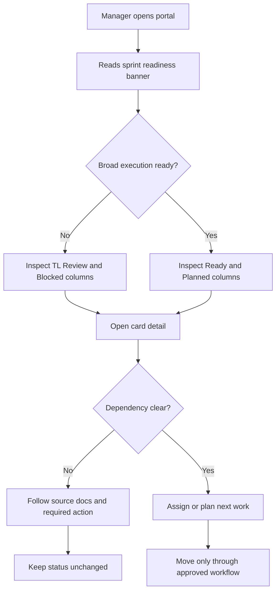

# OpenJira Manager View UI Report

Owner: Beatriz Nogueira  
Squad: AIA - UX/UI  
Date: 2026-07-01  
Target implementation owner: Lucas Ferreira  
Status: prototype report before implementation

## Objective

Create a modern, responsive manager view for the `openjira-docs` portal that helps Mariana, Rafael, Helena, QA, CI/CD, Documentation, and the requester understand sprint readiness without reading the full backlog every time.

The view must keep the portal as an operational work tool, not a marketing page. It should answer, in one screen:

- What is the active sprint?
- Which cards are ready, blocked, done, planned, or waiting for TechLead review?
- Why is broad execution still blocked?
- Which card should be opened next?
- What evidence or dependency is missing?

This report is a UX/UI contract only. It does not authorize product implementation or changes in `src/` before TechLead approval.

## Current Portal Read

Read files:

- `README.md`
- `src/content.js`
- `src/main.js`
- `src/styles.scss`
- `docs/sprints/sprint-000-plan.md`
- `docs/product/mvp-backlog.md`

Current strengths:

- Clear static portal strategy with Vite, JavaScript, Tailwind CSS, and SCSS.
- Existing app shell has sticky topbar, sidebar summary, hero, sprint status, workflow board, roadmap, and documentation grid.
- `src/content.js` already centralizes docs, agents, sprint status, roadmap, sprint cards, and workflow columns.
- Visual density is appropriate for an internal operational portal.
- Sprint 000 status is explicit: active, but not ready for broad execution.

Current UX gaps:

- Work cards are visual summaries only; they are not clickable and do not expose details, dependencies, evidence, acceptance criteria, or next action.
- The board is useful, but managers still need to inspect Markdown files to understand why a card is in `TL Review` or blocked.
- The hero takes attention that should be spent on sprint status and decision-making.
- Navigation mixes documentation topics with operational actions; the manager view needs a clearer primary path.
- Mobile behavior should preserve access to metrics, filters, and card detail without relying on horizontal scanning only.

## Information Architecture

Primary navigation should prioritize operational review:

1. Sprint status
2. Workflow board
3. Card detail
4. Roadmap
5. Docs index
6. Squad and governance

Recommended page sections:

| Section | Purpose | Primary user question |
| --- | --- | --- |
| Header | Brand, current sprint, document anchors | Where am I and what sprint is active? |
| Manager summary | Metrics, readiness decision, next card | Can the squad execute now? |
| Workflow board | Cards grouped by status | What is where? |
| Card detail panel | Dependency, owner, evidence, acceptance | Why is this card in this status? |
| Roadmap | Sprint sequencing | What comes next? |
| Docs index | Links to source documents | Where is the source of truth? |
| Squad panel | Owners and role boundaries | Who owns this? |

Hierarchy:



## Layout Proposal

Use a three-zone layout on desktop:

- Left rail: sprint status, filters, squad shortcuts.
- Main canvas: manager summary, board, roadmap.
- Right detail panel: selected task detail.

Desktop wireframe:

```text
+--------------------------------------------------------------------------------+
| OJ OpenJira Docs     SPR-000 Active      Sprint | Board | Roadmap | Docs        |
+----------------------+------------------------------------+--------------------+
| Status               | Manager Summary                    | Selected Card      |
| Ready: 2             | [Not ready for broad execution]    | OJ-008             |
| TL Review: 13        | Next: OJ-008 after OJ-007 evidence | Define functional  |
| Blocked: 1           |                                    | requirements       |
| Done: 5              | Metrics cards                      | Owner, role, P0    |
|                      +------------------------------------+ Dependencies       |
| Filters              | Workflow Board                     | Evidence           |
| [Status] [Owner]     | Ready | TL Review | Planned | ...  | Acceptance         |
| [Priority] [Text]    | card  | card      | empty   | ...  | Next action        |
|                      | card  | card      |         |      | Source links       |
+----------------------+------------------------------------+--------------------+
```

Tablet layout:

- Header remains sticky.
- Sidebar content becomes a collapsible summary band above the board.
- Detail panel becomes a drawer opened from the card.

Mobile layout:

- Top summary appears first.
- Status columns become tabs or a horizontal segmented control.
- Cards stack vertically under the selected status.
- Detail opens as a full-screen route-like panel or bottom sheet with visible close action.

Mobile wireframe:

```text
+--------------------------------+
| OJ Docs        SPR-000 Active   |
+--------------------------------+
| Not ready for broad execution   |
| Ready 2 | TL 13 | Blocked 1     |
+--------------------------------+
| [Ready] [TL Review] [Blocked]   |
+--------------------------------+
| OJ-007 Map core user journeys   |
| Owner Helena | P0 | Ready       |
+--------------------------------+
| OJ-026 Create evidence templates|
| Owner Sofia | P0 | Ready        |
+--------------------------------+
```

## Navigation

Header:

- Brand: `OpenJira Docs`
- Sprint pill: `SPR-000 active`
- Primary anchors: `Status`, `Board`, `Roadmap`, `Docs`
- Secondary action: `View source docs`

Left rail filters:

- Status: all, ready, TL Review, blocked, done.
- Owner: Mariana, Helena, Rafael, Beatriz, Lucas, Gabriel, Eduardo, Camila, Bruno, Renata, Sofia.
- Priority: P0, P1.
- Text search: card id or title.

Interaction rules:

- Selecting a card updates the detail panel without changing scroll position on desktop.
- On mobile, selecting a card opens detail in a focused panel.
- Active filters must be visible as removable chips.
- Empty filtered results must explain that no cards match the selected filters.
- `Blocked` and `TL Review` states should visually explain that execution must not start yet.

## Clickable Cards And Task Detail

Cards should become buttons or links with semantic focus behavior. Minimum visible card fields:

- Card id
- Title
- Status badge
- Priority
- Owner
- Role
- Dependency count or blocker indicator

Detail panel fields:

- Card id and title
- Status and priority
- Owner, assignee, role
- Tags
- Dependencies
- Evidence path
- Acceptance criteria summary
- Test expectations
- QA expectations
- Documentation expectations
- Next action
- Source document link or anchor

Recommended detail rules by status:

| Status | Detail emphasis | Primary message |
| --- | --- | --- |
| Done | Evidence and acceptance | Completed with evidence |
| Ready for Sprint | Planning readiness | Approved and can be planned |
| TL Review | Dependency and review gap | Do not execute before TechLead acceptance |
| Planned | Sprint scope | Selected for active sprint |
| In Development | Active owner and validation | Work in progress |
| Blocked | Required action and blocker owner | Cannot continue until dependency is resolved |

Card click flow:



## Visual Direction

The UI should feel like an internal delivery operations console:

- Compact.
- Calm.
- Status-led.
- Optimized for scanning and repeated review.
- Avoid marketing hero composition.
- Avoid oversized decorative blocks.
- Avoid nested cards.

Recommended changes from current visual hierarchy:

- Reduce hero prominence or convert it into a manager summary band.
- Make `work-status` the primary first viewport element.
- Keep 8px radius maximum for cards and panels.
- Preserve white surfaces over neutral page background.
- Use color as status reinforcement, not decoration.

## Color Tokens

Use named tokens instead of scattering raw hex values in future implementation.

```text
--color-bg-page: #f7f8fa
--color-bg-surface: #ffffff
--color-bg-subtle: #fbfcfe
--color-bg-muted: #f6f8fb

--color-border-default: #d9dee7
--color-border-subtle: #e2e7ef
--color-border-focus: #0b5cff

--color-text-strong: #101828
--color-text-default: #344054
--color-text-muted: #526071
--color-text-soft: #697586

--color-brand: #0b5cff
--color-brand-strong: #084ab8

--color-status-ready: #2cb376
--color-status-ready-bg: #eaf8f1
--color-status-ready-text: #067647

--color-status-review: #7c3aed
--color-status-review-bg: #f1ebff
--color-status-review-text: #5b21b6

--color-status-blocked: #d92d20
--color-status-blocked-bg: #fdecec
--color-status-blocked-text: #b42318

--color-status-planned: #98a2b3
--color-status-planned-bg: #eef2f7
--color-status-planned-text: #475467

--color-status-active: #0b5cff
--color-status-active-bg: #e8f1ff
--color-status-active-text: #084ab8
```

Contrast expectations:

- Body text and badges must meet WCAG AA.
- Focus ring must be visible on white and muted backgrounds.
- Status cannot rely on color alone; always include a text label.

## Typography

Recommended stack:

```text
Inter, ui-sans-serif, system-ui, -apple-system, BlinkMacSystemFont, "Segoe UI", sans-serif
```

Scale:

| Token | Size | Weight | Usage |
| --- | --- | --- | --- |
| `text-xs` | 11-12px | 700-800 | badges, keys, labels |
| `text-sm` | 13-14px | 400-700 | cards, nav, metadata |
| `text-md` | 15-16px | 400-750 | panel body, list items |
| `heading-sm` | 18-20px | 750 | card detail title |
| `heading-md` | 24-28px | 750 | section heading |
| `heading-lg` | 32-40px | 800 | first viewport summary only |

Rules:

- Keep letter spacing at `0`.
- Do not scale font size by viewport width.
- Use short labels and wrap long card titles.
- Avoid uppercase paragraphs; uppercase is acceptable for small labels only.

## Components

Required component inventory for Lucas:

| Component | Purpose | Required states |
| --- | --- | --- |
| `AppHeader` | Brand, sprint badge, primary nav | default, sticky, mobile wrapped |
| `ManagerSummary` | Readiness decision and next action | ready, blocked, warning |
| `MetricTile` | Count by status | default, active/filter selected |
| `FilterBar` | Status, owner, priority, text search | default, dirty, empty result |
| `WorkflowBoard` | Status columns | loading, empty, filtered, populated |
| `WorkflowColumn` | One status group | empty, populated, overflow |
| `TaskCard` | Clickable card summary | default, hover, focus, selected, blocked |
| `TaskDetailPanel` | Full detail of selected card | empty, loading, selected, error |
| `StatusBadge` | Status label | all workflow statuses |
| `SourceLink` | Link to Markdown source | default, hover, focus |
| `ResponsiveDrawer` | Mobile card detail | open, closing, closed |
| `EmptyState` | No cards or no filter match | neutral, actionable |
| `AlertBanner` | Sprint readiness/blocker message | info, warning, blocked |

## States

Board states:

- Loading: skeleton columns with stable widths.
- Empty status: column-level message from `workflowColumns.empty`.
- Empty filter result: one board-level message with clear filters action.
- Error: visible message that preserves source links to Markdown.
- Stale data: optional timestamp from content metadata when available.

Card states:

- Default: white surface, status left border, compact metadata.
- Hover: subtle border and background change.
- Focus: 2px brand outline with offset.
- Selected: stronger border and right-panel sync.
- Blocked: red left border, blocker text, no execution CTA.

Detail states:

- No selection: show "Select a card to inspect dependencies and evidence."
- Selected: show complete task detail.
- Missing optional fields: show `Not documented yet`, not a blank area.
- Source unavailable: show non-blocking warning.

Accessibility baseline:

- Cards must be keyboard reachable.
- `Enter` or `Space` opens detail.
- Detail drawer must trap focus on mobile and return focus to the originating card on close.
- Board columns need headings and counts.
- Metrics used as filters must expose selected state to assistive tech.
- Drag/drop references are out of scope for this docs portal; future OpenJira app must include keyboard fallback.

## Manager Readiness Flow



## Content Mapping

Initial data can continue coming from `src/content.js`, but card detail needs richer fields from `docs/product/mvp-backlog.md` and `docs/sprints/sprint-000-plan.md`.

Minimum future data shape:

```js
{
  id: 'OJ-008',
  title: 'Define functional requirements by domain',
  owner: 'Helena Duarte',
  assignee: 'Helena Duarte',
  role: 'Requirements',
  priority: 'P0',
  status: 'tl-review',
  tags: ['REQUIREMENTS', 'MVP'],
  dependencies: ['OJ-007'],
  evidence: null,
  description: 'Define MVP functional requirements grouped by domain.',
  acceptanceCriteria: [
    'Requirements are grouped by domain.',
    'Each requirement has priority.',
    'MVP and post-MVP items are separated.',
    'Requirements reference impacted roles and screens.',
  ],
  testExpectations: ['Requirements can be converted into acceptance tests.'],
  qaExpectations: ['No requirement is ambiguous or unverifiable.'],
  documentationExpectations: ['Publish requirements matrix in Markdown.'],
  nextAction: 'Can start after TechLead accepts OJ-007 evidence.',
  sourcePath: 'docs/product/mvp-backlog.md'
}
```

## Acceptance Criteria For Lucas

Lucas can consider the future UI implementation ready for UX review when:

- First viewport shows sprint status, readiness decision, key metrics, and next recommended card without requiring scroll on desktop.
- Workflow board groups cards by the existing statuses from `workflowColumns`.
- Every visible task card is clickable and keyboard accessible.
- Selecting a task opens a detail panel on desktop and a focused detail view on mobile.
- Detail view includes owner, role, priority, status, dependencies, evidence, acceptance criteria, test expectations, QA expectations, documentation expectations, next action, and source path when available.
- `TL Review` and `Blocked` cards explicitly prevent accidental interpretation as executable work.
- Filters exist for status, owner, priority, and text search.
- Active filters are visible and removable.
- Empty, loading, error, selected, hover, focus, and mobile drawer states are implemented.
- Layout works at 320px, 768px, 1024px, and 1440px widths without text overlap.
- Status colors use tokens and never rely on color alone.
- Focus styles are visible and WCAG AA contrast is preserved.
- No app code starts before Rafael/TechLead approves the implementation card.
- Required frontend completion checks remain `npm run lint` and `npm run build` after implementation.

## Files Changed

- `docs/design/openjira-manager-view-ui-report.md`
