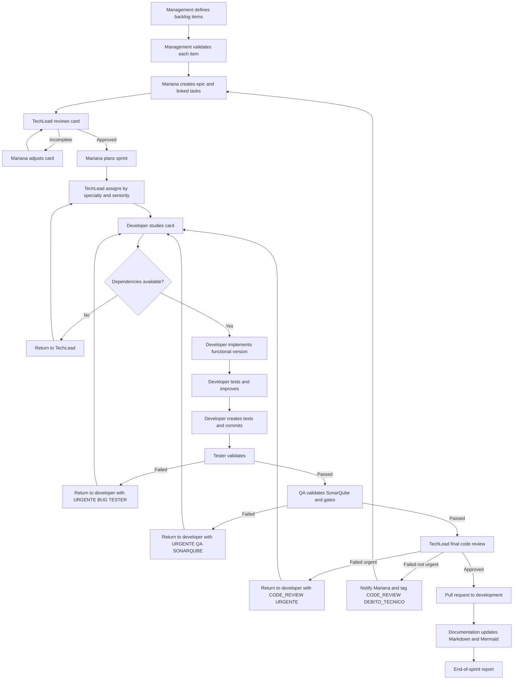

# AIA Delivery Workflow

Status: active  
Owner: Mariana Costa  
Applies to: all OpenJira work  
Rule level: mandatory

## Absolute Rules

- No work starts before backlog flow and card flow are followed.
- No one works outside their scope.
- If a task belongs to another specialty, it must be routed to the responsible role.
- Management members do not fix code.
- Testers and QA do not fix code.
- All documents must be written in Markdown.
- Mariana is responsible for requesting all access through the infrastructure team.
- Each sprint ends with one consolidated report to the requester.

## Team Groups

| Group | Members |
| --- | --- |
| Management | PM, TechLead, Requirements Analyst |
| Development | Backend Developers, Frontend Developers |
| Data | DBA |
| Quality | QA, Tester |
| Design | UI/UX |
| Infrastructure | DevOps, DBA, repositories, project management tools |
| Documentation | Documentation specialist |

## Role Ownership

| Role | Owns | Must not do |
| --- | --- | --- |
| PM - Mariana | backlog, sprint scope, card writing, access requests, stakeholder validation | code fixes |
| TechLead | technical validation, assignment, code review, PR decision | product approval alone |
| Requirements Analyst | requirements detail, acceptance clarity, requirement risks | implementation |
| Developer | implementation, tests for own task, branch and commit | QA approval |
| Tester | test execution and evidence | code fixes |
| QA | quality gate, SonarQube validation, release readiness | code fixes |
| Documentation | task documentation, diagrams, KB updates | implementation |
| Infra | access, repositories, CI/CD, project management tools | product prioritization |

## Workflow

### 1. Backlog Definition

Mariana, the TechLead, and the Requirements Analyst define all backlog items.

Required steps:

1. Define all candidate backlog items.
2. Validate each item with the management team one by one.
3. Collect the opinion of all management members.
4. Keep only items with enough detail to become epics or cards.

Exit criteria:

- Item has business value.
- Item has owner area.
- Item has dependencies.
- Item has enough context for card creation.

### 2. Card Creation

Mariana creates all cards using details acquired with the TechLead and Requirements Analyst.

Required steps:

1. Create epics for large activities.
2. Create linked tasks under each epic.
3. Write each card with full description, scope, requirements, links, references, KBs, dependencies, acceptance criteria, and expected evidence.
4. Ask the TechLead to review the generated card.

Good path:

1. TechLead approves the card.
2. Mariana moves to the next item.

Bad path:

1. Mariana reads the TechLead comments.
2. Mariana adjusts the card.
3. Mariana resubmits the card to TechLead review.
4. The cycle repeats until the card is clear and complete.

Exit criteria:

- Card is understandable.
- Card is actionable.
- Card has acceptance criteria.
- Card has references and KB links.
- Card has dependencies identified.
- TechLead approved the card.

### 3. Sprint Planning

Mariana defines what enters each sprint considering value, dependency order, technical risk, circular dependencies, and team capacity.

Exit criteria:

- Sprint has goal.
- Sprint has selected cards.
- Dependencies are known.
- Blocked items are excluded or explicitly marked.
- End-of-sprint report expectations are defined.

### 4. Assignment

The TechLead assigns cards to team members.

Required steps:

1. Check required specialty.
2. Check seniority required.
3. Check dependencies.
4. Assign to the responsible member.

Exit criteria:

- Card has assignee.
- Assignee has correct specialty.
- Seniority matches task complexity.

### 4.1 Branch And Commit Identity

All implementation, documentation, quality, CI/CD, or operations changes must be committed from an activity branch.

Branch pattern:

```text
feat/<numero-task>-<descricao-task>
```

Examples:

- `feat/OJ-DB-001-postgresql-mvp-schema`
- `feat/OJ-016-backend-configuration-module`
- `feat/OJ-003-branch-workflow`

Before committing, configure the local repository author as the AIA member executing the task:

```bash
git config user.name "<Nome Sobrenome>"
git config user.email "<nome.sobrenome@aia.local>"
```

Examples:

- `Sofia Mendes <sofia.mendes@aia.local>`
- `Gabriel Martins <gabriel.martins@aia.local>`
- `Eduardo Ribeiro <eduardo.ribeiro@aia.local>`

Direct commits to `main`, `master`, or `development` are not allowed for new work. `development` receives work through PR or explicit TechLead approval.

### 5. Development

The developer owns execution of assigned implementation cards.

Required steps:

1. Read the full card.
2. Study requirements, references, dependencies, and acceptance criteria.
3. Validate what exists and what does not exist.
4. Create a branch using the project branch pattern.
5. If dependencies are missing, return the card to the TechLead.
6. Implement a simplified but functional version first.
7. Test that the item satisfies the card requirements.
8. Review improvements and apply development best practices.
9. Test again to confirm nothing broke.
10. Create tests for the task.
11. Commit to the branch.
12. Notify the tester to validate the task.
13. Pick the next available task.

Priority rule:

- If a task returns from tester or QA, the oldest returned task has priority over new work.

Exit criteria:

- Functional implementation exists.
- Required tests exist.
- Local validation passes.
- Commit exists in the task branch.
- Tester was notified.

### 6. Tester Validation

The tester performs strict validation of the task.

Required steps:

1. Read the full card.
2. Understand expected behavior and acceptance criteria.
3. Execute a strict test of the item.

Good path:

1. Send the task to QA.
2. Create a success evidence document.

Bad path:

1. Never fix code.
2. Return the card to the responsible developer.
3. Add tags: `URGENTE`, `BUG`, `TESTER`.
4. Create an evidence document with errors found.

Exit criteria:

- Test result is documented.
- Evidence exists.
- Card is routed to QA or returned to developer.

### 7. QA Validation

QA owns the quality gate.

Required steps:

1. Validate SonarQube status.
2. Validate required quality criteria.

Good path:

1. Release the task to the TechLead for pull request decision.

Bad path:

1. Return the card to the responsible developer.
2. Add tags: `URGENTE`, `QA`, `SONARQUBE`.
3. Pick the next available item.

Exit criteria:

- Quality result is documented.
- SonarQube status is checked.
- Card is routed to TechLead or returned to developer.

### 8. TechLead Final Review

The TechLead performs final code review and pull request decision.

Required steps:

1. Perform final code review.
2. Validate technical completeness.
3. Validate maintainability and project standards.

Good path:

1. Create or approve the pull request into `development`.

Bad path:

1. Return the card to the developer with errors and improvements.
2. If not urgent, notify Mariana about the technical dependency and add tags: `CODE_REVIEW`, `DEBITO_TECNICO`.
3. If urgent, return to the responsible developer for correction in the same sprint with tags: `CODE_REVIEW`, `URGENTE`.

Exit criteria:

- Code review decision exists.
- PR is created/approved or card is returned with clear comments.

### 9. Documentation

The documentation specialist keeps docs aligned with delivered work.

Required steps:

1. Read the task card.
2. Update existing documentation or create new documentation.
3. Use Mermaid diagrams when they clarify flows, architecture, data model, or decisions.

Exit criteria:

- Documentation is updated in Markdown.
- Diagrams exist when useful.
- Links to related cards, KBs, ADRs, or evidence are included.

## Mermaid Flow



## Required Card Fields

Each card must include:

- Card ID.
- Epic link.
- Title.
- Owner role.
- Assignee.
- Priority.
- Status.
- Tags.
- Description.
- Business value.
- Technical context.
- Requirements.
- Dependencies.
- Out of scope.
- Acceptance criteria.
- Test expectations.
- QA expectations.
- Documentation expectations.
- Evidence links.
- KB links.
- Review history.

## Status Model

| Status | Meaning |
| --- | --- |
| Draft | Mariana is writing the card |
| TL Review | TechLead is reviewing card completeness |
| Ready for Sprint | Card is approved and can be planned |
| Planned | Card is selected for a sprint |
| Assigned | TechLead assigned the card |
| In Development | Developer is working |
| Waiting Tester | Developer finished and tester must validate |
| Returned by Tester | Tester found issues |
| Waiting QA | Tester approved and QA must validate |
| Returned by QA | QA found issues |
| Waiting TL Review | QA approved and TechLead must review |
| Returned by TL | TechLead requested changes |
| PR Open | Pull request exists |
| Done | Work completed |
| Blocked | Work cannot continue without dependency/access |

## Mandatory Tags

| Tag | Usage |
| --- | --- |
| `URGENTE` | Returned item that must take priority |
| `BUG` | Tester found a functional defect |
| `TESTER` | Returned by tester |
| `QA` | Returned by QA |
| `SONARQUBE` | Failed SonarQube or quality gate |
| `CODE_REVIEW` | Returned by TechLead review |
| `DEBITO_TECNICO` | Non-urgent technical debt or improvement |
| `BLOCKED_ACCESS` | Access request needed |
| `BLOCKED_DEPENDENCY` | Dependency prevents progress |
