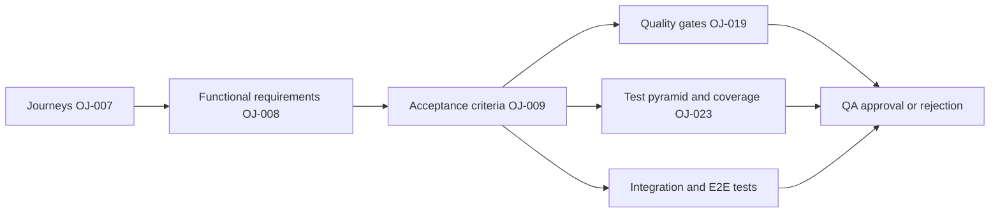

# MVP Acceptance Criteria

Card: OJ-009 - Define acceptance criteria for MVP flows  
Owner: Renata Barbosa  
Role: Quality Gate/QA  
Status: evidence for TechLead review  
Source journeys: `docs/requirements/core-user-journeys.md`  
Source requirements: `docs/requirements/functional-requirements-matrix.md`  
Source test policy: `docs/quality/test-policy.md`  
Last updated: 2026-07-02

## Purpose

Convert the MVP user journeys and functional requirements into objective, testable acceptance criteria. This document is the QA source for deciding whether MVP flows pass, fail, or require an approved exception before broader implementation work continues.

## Decision Rules

- Every P0 criterion must pass before the related MVP flow can be accepted.
- A P1 criterion may be accepted with a documented exception only when the exception includes reason, manual evidence, follow-up card, and TechLead approval.
- A criterion fails when the expected result is missing, the negative expectation is violated, or required evidence is unavailable.
- Permission failures must be authorization-safe: no restricted organization names, project names, issue titles, comments, counts, metadata, history, or member data may be exposed.
- UI acceptance must be backed by evidence from tester execution, QA review, automated integration/E2E tests when available, or an approved manual-evidence exception.

## Traceability

## Acceptance Criteria Matrix

| ID | Related requirement IDs | Flow | Scenario | Preconditions | Steps or trigger | Expected result | Failure or negative expectation | Priority | Evidence expectation |
| --- | --- | --- | --- | --- | --- | --- | --- | --- | --- |
| OJ-AC-LOGIN-001 | OJ-FR-AUTH-002 | Login | Valid user authenticates successfully. | User account exists and credentials are valid. | Submit login form with valid credentials. | Authenticated session is created and user is routed to the first accessible organization or organization selection. | User must not remain anonymous, lose session immediately, or be routed to protected data outside their access boundary. | P0 | E2E login success evidence; integration/API auth success evidence when backend exists. |
| OJ-AC-LOGIN-002 | OJ-FR-AUTH-003 | Login | Invalid credentials are rejected safely. | Login screen is available. | Submit invalid email, username, password, or inactive-account credential combination. | User remains on login screen and sees a generic login error. | Error must not identify whether email, username, password, or account status caused the failure. No session is created. | P0 | E2E or manual negative login evidence; API auth failure evidence. |
| OJ-AC-LOGIN-003 | OJ-FR-AUTH-001, OJ-FR-PER-001, OJ-FR-PER-002 | Login / protected access | Anonymous user attempts protected MVP routes. | User has no active session. | Open organization, project, board, issue, comment, filter, member, permission, or audit route directly. | User is redirected to login in UI context or receives an authorization response in API context. | Protected payload, identifiers, counts, or cached restricted data must not be rendered or returned. | P0 | Route-guard E2E evidence; API authorization evidence for protected reads and writes. |
| OJ-AC-ORG-001 | OJ-FR-ORG-001, OJ-FR-MEM-001, OJ-FR-PROJ-001 | Organization/project | Authenticated user selects accessible organization and project. | User is authenticated and has at least one accessible organization with at least one accessible project. | Load organization selection, select organization, load projects, select project. | Only accessible organizations and projects are listed; selected project opens its board. | Restricted organizations or projects must not appear in lists, search results, labels, counts, URLs, or metadata. | P0 | Integration evidence for scoped lists; E2E organization/project selection evidence. |
| OJ-AC-ORG-002 | OJ-FR-ORG-002, OJ-FR-PER-002 | Organization/project | Authenticated user has no accessible organizations. | User is authenticated with zero organization membership or explicit access. | Load organization selection. | No-access empty state is shown. | Empty state must not reveal restricted organization names, counts, owners, projects, or invitation state. | P0 | E2E or manual empty-state evidence; API list returns only safe empty result. |
| OJ-AC-ORG-003 | OJ-FR-PROJ-002, OJ-FR-PROJ-003, OJ-FR-PER-002 | Organization/project | User has organization access but no project access, or opens a restricted project directly. | User is authenticated and either has no accessible projects in selected organization or lacks access to target project. | Load project selection or open restricted project URL. | Project empty state or authorization-safe failure is shown. | Restricted project name, key, board, issue count, member data, or metadata must not be exposed. | P0 | E2E no-project and restricted direct-link evidence; API authorization evidence. |
| OJ-AC-BRD-001 | OJ-FR-BRD-001, OJ-FR-BRD-002, OJ-FR-BRD-003 | Board load | Accessible project board loads successfully. | User is authenticated and has project access; project has one MVP board and visible issues. | Open project board. | Board context loads with workflow columns and each visible issue appears in its persisted column with type, title, priority, assignee, and status. | Issue must not appear in multiple columns, outside the project, or with restricted fields visible to unauthorized users. | P0 | E2E board load evidence; integration evidence for board payload and issue grouping. |
| OJ-AC-BRD-002 | OJ-FR-BRD-004, OJ-FR-ISS-001 | Board empty state | Accessible project has no visible issues. | User has project access and project has zero visible issues. | Open project board. | Empty board state is shown; create action remains available only when create permission allows it. | Empty board must not imply hidden restricted issue counts or expose restricted issue metadata. | P1 | E2E or manual empty board evidence; permission variant evidence for create action visibility. |
| OJ-AC-BRD-003 | OJ-FR-BRD-005, OJ-FR-PER-002 | Board error state | Board data cannot be loaded. | User has project access but board load request fails or dependency is unavailable. | Trigger recoverable board load failure. | Recoverable error state is shown with a retry path or equivalent recovery action. | UI must not present stale, partial, or restricted data as complete board state. | P1 | Manual or automated fault-injection evidence; screenshot/log of recoverable error state. |
| OJ-AC-ISS-001 | OJ-FR-ISS-001, OJ-FR-ISS-003, OJ-FR-MEM-002, OJ-FR-AUD-001 | Issue create | Permitted user creates a valid issue. | User has project access and create permission; eligible assignee exists or assignee is optional. | Open create form, fill required fields, optionally set type, priority, assignee, description, submit. | Issue is created in the initial workflow column, appears on board, optional fields persist when valid, and basic creation history is recorded. | Assignee options must be limited to eligible project members; no partial issue may be created outside the selected project. | P0 | E2E create issue evidence; integration evidence for persistence, assignee scope, and audit history. |
| OJ-AC-ISS-002 | OJ-FR-ISS-002 | Issue create | Missing or invalid issue fields are rejected. | User has create permission and create form is open. | Submit missing required fields or invalid field values. | Field-level validation errors are shown and safe user-entered values are preserved. | No issue, partial issue, audit record, board card, or notification side effect is created from invalid input. | P0 | E2E or component validation evidence; API validation evidence. |
| OJ-AC-ISS-003 | OJ-FR-ISS-004, OJ-FR-AUD-002, OJ-FR-COM-003 | Issue detail | Accessible issue detail opens. | User has project and issue access; issue exists. | Open issue from board or direct issue link. | Detail shows title, description, type, priority, status, reporter, assignee, comments, and basic history; user can return to board context. | Restricted fields, comments, or history outside the issue boundary must not be displayed. | P0 | E2E issue detail evidence; integration evidence for detail payload and history visibility. |
| OJ-AC-ISS-004 | OJ-FR-ISS-005, OJ-FR-ISS-006, OJ-FR-PER-002 | Issue detail | Nonexistent or restricted issue is opened. | User is authenticated; issue either does not exist or exists in a restricted project. | Open issue URL directly. | Nonexistent issue shows not found; restricted issue shows authorization-safe failure. | System must not create placeholder data or reveal restricted title, comments, history, status, reporter, assignee, project, or counts. | P0 | E2E direct-link negative evidence; API not-found/forbidden safety evidence. |
| OJ-AC-ISS-005 | OJ-FR-ISS-007, OJ-FR-AUD-001 | Issue edit | Permitted user edits allowed issue fields. | User has issue access and edit permission. | Open issue detail, edit allowed fields, submit valid changes. | Changes persist, issue detail and board summary refresh, and basic change history records actor, field/action, and timestamp. | Fields outside the user's allowed edit scope must not be changed. | P0 | E2E edit evidence; integration evidence for persistence and audit history. |
| OJ-AC-ISS-006 | OJ-FR-ISS-008, OJ-FR-ISS-009, OJ-FR-PER-003 | Issue edit | Invalid or unauthorized issue edit is blocked. | User has issue access but submits invalid update or lacks edit permission. | Submit invalid update, use hidden/disabled edit action, or call edit API directly. | Validation feedback or authorization-safe error is shown; previous persisted issue remains unchanged. | No field change, audit record, board summary change, or restricted data leak may occur. | P0 | E2E negative edit evidence; API authorization and validation evidence. |
| OJ-AC-ISS-007 | OJ-FR-BRD-006, OJ-FR-AUD-001 | Issue move | Permitted user moves issue across workflow columns. | User has project, issue, and movement permission; target column belongs to the same project board. | Drag/drop issue or use accessible move control to move issue to another column. | Movement persists, board shows issue in the new column only, and movement history records actor, previous column, target column, and timestamp. | Movement must not allow cross-project target columns or duplicate issue cards. | P0 | E2E movement evidence including accessible fallback; integration evidence for movement persistence and audit. |
| OJ-AC-ISS-008 | OJ-FR-BRD-007, OJ-FR-ISS-009, OJ-FR-PER-003 | Issue move | Invalid, stale, or unauthorized movement is rejected. | Issue move is attempted with invalid target, stale state, changed issue availability, or missing movement permission. | Trigger invalid move, stale move, unauthorized move, or direct API move request. | Issue returns to last persisted column or board refreshes to current persisted state with recoverable feedback. | No duplicate cards, cross-project movement, unauthorized mutation, or restricted data leak may occur. | P0 | E2E or integration stale/invalid movement evidence; API authorization evidence. |
| OJ-AC-COM-001 | OJ-FR-COM-001, OJ-FR-COM-003, OJ-FR-AUD-003 | Comments | Permitted user adds a valid comment. | User has issue access and comment permission. | Open issue detail, enter valid comment content, submit. | Comment is saved and shown with immutable author and creation time. | Comment must not appear on another issue, lose author/time, or expose hidden issue data. | P0 | E2E comment creation evidence; integration evidence for persistence and immutable fields. |
| OJ-AC-COM-002 | OJ-FR-COM-002 | Comments | Empty or invalid comment is rejected. | User has issue access and comment form is available. | Submit empty, whitespace-only, or invalid comment content. | Validation feedback is shown. | Blank or invalid comment record must not be created, rendered, or counted. | P0 | E2E or component validation evidence; API validation evidence. |
| OJ-AC-COM-003 | OJ-FR-COM-003, OJ-FR-PER-002, OJ-FR-PER-003 | Comments | Restricted issue comments are not visible or writable. | User lacks issue access or comment permission. | Open restricted issue, load comments, or submit comment through UI/API. | Access is blocked with authorization-safe response or UI state. | Restricted comments, authors, timestamps, counts, issue title, or project metadata must not be revealed; no comment is created. | P0 | E2E restricted comment evidence; API authorization evidence. |
| OJ-AC-FLT-001 | OJ-FR-FLT-001, OJ-FR-FLT-002, OJ-FR-FLT-003 | Filters | User applies and clears supported board filters. | User has project board access and visible issues with varied fields. | Apply status/column, assignee, priority, issue type, and text search filters; clear filters. | Matching visible issues are shown grouped by board column; clearing filters restores default board view. | Filters must not include restricted issues or reveal hidden counts/metadata. | P0 | E2E filter apply/clear evidence; integration evidence for scoped filtering. |
| OJ-AC-FLT-002 | OJ-FR-FLT-004 | Filters | Supported filter combination returns no visible matches. | User has board access and applies filters with no visible matching issues. | Apply filter combination with zero visible results. | Empty filtered state is shown with a path to clear filters. | Empty state must not imply or expose restricted issue counts, keys, titles, or metadata. | P1 | E2E or manual filtered empty-state evidence. |
| OJ-AC-FLT-003 | OJ-FR-FLT-005, OJ-FR-PER-002 | Filters | Unsupported or invalid filter input is handled safely. | User has board access. | Enter unsupported filter parameter, invalid value, malformed text search, or direct API filter input. | System ignores unsupported input or returns validation feedback without breaking board view. | Invalid input must not reveal restricted counts, metadata, stack traces, or implementation details. | P1 | Integration/API invalid filter evidence; UI evidence for stable board state. |
| OJ-AC-PER-001 | OJ-FR-PER-001, OJ-FR-PER-002, OJ-FR-PER-003 | Permission failures | Read and write permissions are enforced across MVP domains. | User is anonymous or authenticated without required membership/role/action permission. | Attempt protected reads and writes for organizations, projects, boards, issues, comments, filters, memberships, roles, and audit history. | Access is denied server-side and UI shows an authorization-safe state when applicable. | No restricted payload, identifiers, aggregate counts, cached data, mutation, or audit side effect may be exposed to the unauthorized user. | P0 | Integration authorization matrix evidence; representative E2E permission-failure evidence. |
| OJ-AC-PER-002 | OJ-FR-PER-004 | Permission failures | Admin-level membership or role operation requires admin role. | User is authenticated but lacks organization admin or project admin role. | Attempt membership or role administration via UI or API. | Action is unavailable or rejected with authorization-safe error. | Non-admin user must not create, edit, remove, list restricted membership details, or infer role assignments outside their boundary. | P0 | API authorization evidence; manual or E2E UI permission evidence when admin UI exists. |

## Objective QA Approval Matrix

| Flow | Required criteria | Minimum pass condition | Reject when | Primary downstream test target |
| --- | --- | --- | --- | --- |
| Login | OJ-AC-LOGIN-001, OJ-AC-LOGIN-002, OJ-AC-LOGIN-003 | Valid login works, invalid login is generic, anonymous protected access is blocked. | Credential-specific failure reason, protected data leak, or missing session behavior evidence. | E2E login suite; auth integration tests. |
| Organization/project | OJ-AC-ORG-001, OJ-AC-ORG-002, OJ-AC-ORG-003 | Only accessible organizations/projects render; empty and restricted states are safe. | Restricted org/project identifiers, counts, members, or metadata appear. | E2E access selection; scoped list integration tests. |
| Board | OJ-AC-BRD-001, OJ-AC-BRD-002, OJ-AC-BRD-003 | Board loads, empty state is clear, recoverable error does not misrepresent stale data. | Duplicate cards, wrong columns, restricted fields, or unsafe stale board data. | E2E board suite; board API integration tests. |
| Issue create/detail/edit/move | OJ-AC-ISS-001 through OJ-AC-ISS-008 | Valid operations persist and audit; invalid, stale, and unauthorized operations leave persisted state unchanged. | Partial issue, missing validation, unauthorized mutation, duplicate movement, or audit omission on required actions. | E2E issue lifecycle; issue service/API integration tests. |
| Comments | OJ-AC-COM-001, OJ-AC-COM-002, OJ-AC-COM-003 | Valid comments persist with immutable author/time; invalid and restricted comments are blocked. | Blank comment, missing author/time, restricted comment leak, or unauthorized comment creation. | E2E comments; comments API integration tests. |
| Filters | OJ-AC-FLT-001, OJ-AC-FLT-002, OJ-AC-FLT-003 | Supported filters narrow visible issues, clear restores board, empty/invalid states are safe. | Restricted issue inference, broken board state, or unsupported filter exposing implementation detail. | E2E filters; board filtering integration tests. |
| Permission failures | OJ-AC-PER-001, OJ-AC-PER-002 | Authorization is enforced before every protected read/write and failure messages are safe. | Any restricted data leakage, client-only enforcement, unauthorized mutation, or missing negative evidence. | Authorization integration matrix; targeted E2E denial paths. |

## Evidence Classification

| Evidence type | Acceptable use | Minimum content |
| --- | --- | --- |
| Automated E2E evidence | Critical user journeys once UI and backend are connected. | Command, environment, commit/branch, scenario IDs, pass/fail result, screenshots or trace when useful. |
| Integration evidence | API, database, service, RBAC, persistence, filtering, and audit behavior. | Command, fixture setup, scenario IDs, expected response/state, actual response/state. |
| Manual QA evidence | Temporary substitute when automation is not available yet or access is blocked. | Tester/QA name, date, environment, steps, expected result, actual result, screenshots/logs, linked follow-up when automation is missing. |
| Exception evidence | Missing automated coverage for an accepted criterion. | Reason automation is not possible, manual evidence link, follow-up card, TechLead approval. |

## Downstream Use

### OJ-019 - Quality Gates

OJ-019 must use this matrix to define blocking checks and release rules. At minimum, any P0 acceptance criterion without passing evidence is a QA gate failure unless an approved exception exists. Permission-data leakage, unauthorized mutation, missing validation on critical writes, and failed build/test commands must be release blockers.

### OJ-023 - Test Pyramid And Coverage Policy

OJ-023 must map each criterion to the lowest effective automated layer:

- Unit tests for pure validation and UI state helpers.
- Integration tests for auth, RBAC, persistence, filtering, audit, and API error safety.
- E2E tests for login, organization/project selection, board load/empty/error, issue lifecycle, comments, filters, and representative permission failures.
- Manual evidence only where automation is not yet feasible and the exception policy is followed.

### Integration And E2E Test Design

Integration and E2E suites should use criterion IDs as stable test-case references. Test names, fixtures, and evidence filenames should include the related `OJ-AC-*` ID so tester, QA, TechLead, and CI results can be traced back to one objective acceptance rule.

## QA Gate Summary

The MVP flow is approvable only when:

- All P0 criteria in the relevant flow pass.
- P1 criteria pass or have approved exceptions.
- Required evidence is attached and traceable by criterion ID.
- No permission failure leaks restricted data.
- No rejected validation or authorization path mutates persisted state.
- Downstream test plans in OJ-019 and OJ-023 can point to this document without adding subjective interpretation.
