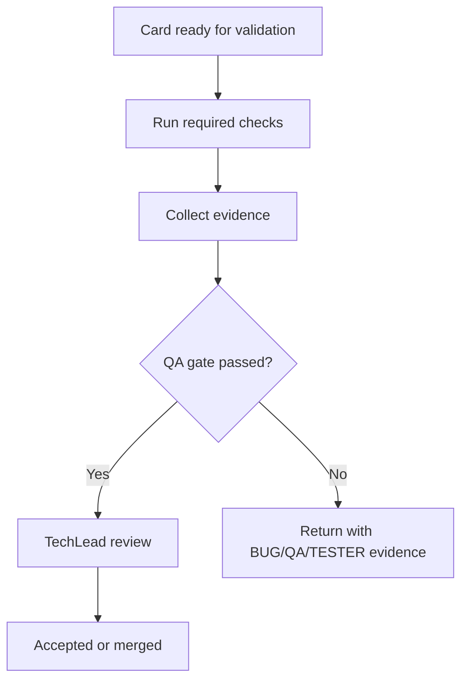

# Quality Gates

Card: OJ-019 - Define quality gates  
Owner: Renata Barbosa  
Role: Quality Gate/QA  
Status: evidence for TechLead review  
Source acceptance criteria: `docs/quality/mvp-acceptance-criteria.md`  
Source test policy: `docs/quality/test-policy.md`  
Last updated: 2026-07-03

## Decision

Quality gates are blocking for MVP-critical changes. A card cannot be accepted when required checks fail, P0 acceptance criteria lack evidence, or authorization-safe behavior is not proven.

## Required Checks

| Area | Frontend | Backend | Docs |
| --- | --- | --- | --- |
| Install reproducibility | `npm ci` | `npm ci` | `npm ci` |
| Lint | `npm run lint` | `npm run lint` | Not required unless script exists |
| Typecheck | `npm run typecheck` when available | `npm run typecheck` when available | Not required unless script exists |
| Build | `npm run build` | `npm run build` | `npm run build` |
| Unit tests | Required when business/UI logic exists | Required when domain/policy logic exists | Not required |
| Integration tests | API client integration when added | Required for auth, RBAC, persistence, filters, audit | Not required |
| E2E/P2P | Required for critical MVP flows once UI/backend connect | Supports API state setup | Not required |
| Security/dependency audit | Required before MVP release | Required before MVP release | Required before public docs release when dependencies change |
| SonarQube | Required when access exists | Required when access exists | Optional unless configured |

## Minimum Test Expectations

- P0 criteria from `docs/quality/mvp-acceptance-criteria.md` need automated evidence or approved exception.
- Authorization, validation, persistence, audit, and filtering require backend integration evidence.
- Login, organization/project selection, board load, issue lifecycle, comments, filters, and representative permission failures require E2E/P2P evidence before MVP release.
- Manual evidence is temporary and must include reason, environment, steps, result, artifacts, follow-up card, and TechLead approval.

## Blocking Criteria

A card fails QA when any item applies:

- Required build, lint, typecheck, or test command fails.
- A P0 acceptance criterion has no passing evidence and no approved exception.
- Unauthorized user can read restricted data or mutate state.
- Invalid input creates partial data, audit noise, or inconsistent UI state.
- Database migration drift exists.
- Secrets, tokens, credentials, or private data appear in logs, commits, screenshots, docs, or generated artifacts.
- Required documentation or evidence links are missing.
- SonarQube reports a blocker or critical issue once SonarQube is active.

## Thresholds

| Gate | Threshold |
| --- | --- |
| Lint | 0 errors. Warnings require TechLead decision before release. |
| Typecheck | 0 errors. |
| Build | 0 errors. |
| Unit tests | 100% pass for touched suites. |
| Integration tests | 100% pass for required MVP suites. |
| E2E/P2P | 100% pass for critical MVP journeys before release. |
| Coverage | Target baseline before MVP release: >=80% lines/statements/functions and >=70% branches; no decrease below approved baseline. |
| Dependency audit | No critical/high runtime vulnerability without approved exception. |
| SonarQube | Quality Gate must pass when configured. |

## Evidence Requirements

Every QA decision includes card ID, commit or branch, commands, environment, result, evidence links, and exceptions/follow-up cards when automation is missing.

## Open Dependencies

- OJ-023 defines final test pyramid and coverage policy.
- OJ-020 defines CI/CD execution and required branch checks.
- SonarQube thresholds become enforceable after access and project setup.

## Acceptance Result

OJ-019 is ready for TechLead review.
