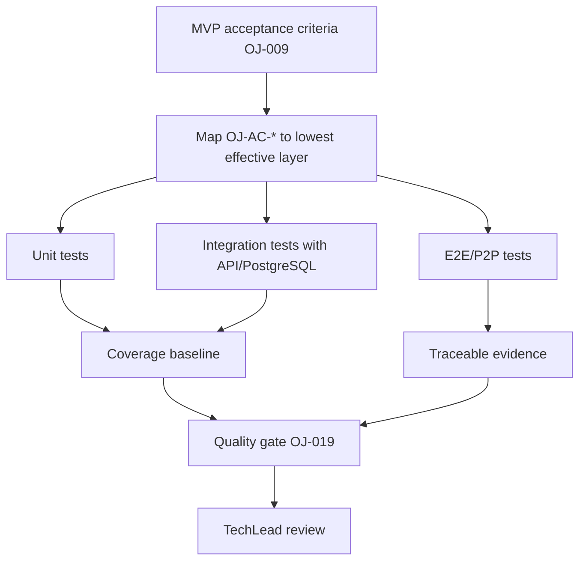

# Test Pyramid And Coverage Policy

Card: OJ-023 - Define test pyramid and coverage policy  
Owner: Bruno Teixeira  
Role: Test Engineering  
Status: evidence for TechLead review  
Source quality gates: `docs/quality/quality-gates.md`  
Source acceptance criteria: `docs/quality/mvp-acceptance-criteria.md`  
Last updated: 2026-07-03

## Purpose

Define the test pyramid, coverage minimums, exception process, ownership, local commands, CI commands, and evidence policy for the OpenJira MVP. This policy is separate from OJ-021: OJ-023 defines what coverage and test evidence are required; OJ-021 will define detailed executable integration and E2E implementation.

## Test Pyramid



| Layer | Mandatory use | Examples |
| --- | --- | --- |
| Unit | Pure rules, validation, helpers, and UI states without backend | issue/comment/filter validation, reducers, policy helpers |
| Integration | API contracts, auth/RBAC, persistence, filters, audit, safe errors | `OJ-AC-PER-*`, `OJ-AC-ISS-*`, `OJ-AC-COM-*`, `OJ-AC-FLT-*` |
| E2E/P2P | Critical user journeys with UI and backend connected | login, org/project selection, board, issue lifecycle, comments, filters, permission failures |
| Manual | Temporary only when automation is not viable yet | external access, unavailable environment, approved gap |

Every P0 criterion in `docs/quality/mvp-acceptance-criteria.md` requires automated evidence or an approved exception. Permission, authorization, mutation, and restricted-data leakage paths cannot depend only on manual testing for MVP release.

## Coverage Minimums

| Area | Minimum |
| --- | --- |
| Frontend | >=80% lines/statements/functions and >=70% branches before MVP release |
| Backend | >=80% lines/statements/functions and >=70% branches before MVP release |
| Critical auth/RBAC/validation/audit code | Direct negative-case coverage and no drop below approved baseline |
| Critical E2E/P2P | 100% pass for mandatory MVP journeys before release |
| MVP integration suites | 100% pass for auth, RBAC, persistence, filters, and audit suites |
| Docs | No numeric coverage; build/docs checks required when configured |
| Database | No line coverage; requires migration, seed/fixture, rollback evidence when applicable, and no drift |

Allowed exclusions: generated files, build output, trivial mocks, pure type files without logic, and configuration without executable logic. Exclusions must not remove auth, RBAC, validation, persistence, filters, audit, or payload transformation coverage.

## Local Commands

Current frontend baseline:

```bash
npm ci
npm run lint
npm run build
```

Current backend baseline:

```bash
npm ci
npm run lint
npm run build
npm audit --omit=dev --audit-level=high
```

Current docs baseline:

```bash
npm ci
npm run build
```

PostgreSQL integration baseline when OJ-014/OJ-021 define the environment:

```bash
npm run db:migrate:deploy
npm run test:integration
```

E2E baseline when OJ-021 defines tooling:

```bash
npm run test:e2e
```

When scripts are introduced by OJ-020 or OJ-021, these become mandatory where applicable:

```bash
npm run typecheck
npm run test
npm run test:unit
npm run test:integration
npm run test:e2e
npm run coverage
```

## CI Policy

CI must run the same command families in clean environments with `npm ci`:

- Frontend: install, lint, typecheck when available, build, unit/component tests when available, coverage when available.
- Backend: install, lint, typecheck when available, build, unit tests, integration tests with PostgreSQL, coverage, runtime dependency audit.
- Docs: install, build, deploy artifact validation.
- E2E/P2P: critical MVP flows against connected frontend/backend/test database.

Branches and PRs are blocked when lint, typecheck, build, required tests, coverage baseline, dependency audit, or SonarQube fail.

OJ-020 defines CI/CD mechanics. OJ-023 defines the test and coverage policy that CI must enforce.

## Exceptions

Every exception must include:

| Field | Required content |
| --- | --- |
| Criterion | `OJ-AC-*` ID or affected gate |
| Reason | Why automation is not currently possible |
| Risk | Objective MVP impact |
| Manual evidence | Steps, environment, result, screenshot/log/report |
| Follow-up | Card that removes or automates the exception |
| Approval | TechLead approval with QA aware |

Exceptions without follow-up and TechLead approval are invalid.

## Ownership

| Role | Responsibility |
| --- | --- |
| Bruno Teixeira | OJ-023 policy, test-layer mapping, evidence criteria |
| Renata Barbosa | OJ-019 quality gate application and QA decision |
| Camila Rocha | CI/CD execution in OJ-020/OJ-024 |
| Lucas Ferreira | Frontend tests for UI and App Router modules |
| Gabriel Martins | Backend API, NestJS, auth, and RBAC tests |
| Eduardo Ribeiro | Fixtures, seeds, migrations, drift, and database evidence |
| Rafael Almeida | Technical approval and exception approval |
| Sofia Mendes | Documentation and evidence templates |

## Evidence Requirements

Every evidence package must include card ID, branch/commit, environment, commands, result, report links, useful screenshots/logs, related `OJ-AC-*` IDs, exceptions, and follow-up cards.

Use existing templates in `docs/evidence/`: `tester-success.md`, `tester-failure.md`, `qa-gate.md`, `sonarqube-failure.md`, and `release-evidence.md`.

## Acceptance Result

OJ-023 is ready for TechLead review.
