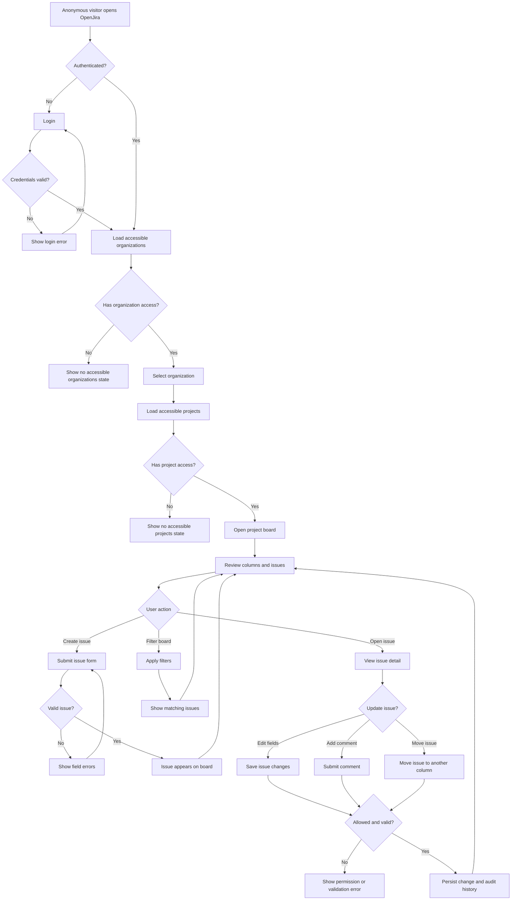

# OpenJira MVP Core User Journeys

Card: OJ-007 - Map core user journeys  
Epic: OJ-E03 - Requirements  
Owner: Helena Duarte  
Role: Requirements  
Status: ready for TechLead validation  
Source workflow: `docs/operations/aia-delivery-workflow.md`  
Source backlog: `docs/product/mvp-backlog.md`  
Last updated: 2026-07-01

## Purpose

Map the MVP journeys that must align frontend, backend, database, QA, tester, and E2E work before implementation starts.

The MVP proves that a product and engineering team can use OpenJira to manage one real project end to end: login, organization, project, board, issues, comments, workflow movement, and basic filters.

## Scope

In scope:

- Login.
- Organization and project access.
- Project board.
- Issue creation.
- Issue detail.
- Issue edit.
- Issue movement across workflow columns.
- Comments.
- Basic filters.
- Permission-sensitive paths.

Out of scope for OJ-007:

- Full functional requirements matrix. This belongs to OJ-008.
- Final acceptance criteria matrix. This belongs to OJ-009.
- API contract. This belongs to OJ-BE-001.
- Database model. This belongs to OJ-013.
- Auth and RBAC strategy details. This belongs to OJ-012.
- Notifications, automations, integrations, billing, and advanced reporting.

## Actors

| Actor | Description |
| --- | --- |
| Anonymous visitor | Person not authenticated in OpenJira. |
| Organization member | Authenticated user with access to at least one organization. |
| Project member | Organization member with access to a specific project. |
| Issue reporter | Project member who creates an issue. |
| Issue assignee | Project member responsible for execution of an issue. |
| Project admin | User allowed to manage project-level settings and membership. |
| Organization admin | User allowed to manage organization-level access. |

## Shared MVP Assumptions

- A user must be authenticated before accessing organizations, projects, boards, issues, comments, and filters.
- A user can only see organizations and projects where they have membership or explicit access.
- Every MVP project has one board.
- The MVP board uses a small Kanban workflow, expected to start with `Backlog`, `Todo`, `In Progress`, `Review`, and `Done`, unless architecture or product decisions adjust the names later.
- An issue belongs to one project and one board column at a time.
- Moving an issue changes its status or column and must be auditable.
- Comments belong to an issue and must preserve author and creation time.
- Filters are project-board scoped in the MVP.
- Permission failures must be explicit and must not leak restricted project or issue data.

## Main MVP Journey

## Journey 1 - Login

Goal: allow a valid user to enter OpenJira and prevent unauthenticated access to protected MVP areas.

Primary actor: Anonymous visitor.

Good path:

1. User opens OpenJira.
2. System shows login entry point when no active session exists.
3. User enters valid credentials.
4. System validates credentials.
5. System starts an authenticated session.
6. System redirects the user to the first accessible organization or organization selection.

Bad path:

1. User enters invalid credentials.
2. System rejects authentication.
3. System shows a generic login error.
4. System keeps the user on the login screen.
5. System does not expose whether email, username, password, or account status caused the failure.

Permission-sensitive behavior:

- Anonymous users cannot access organization, project, board, issue, comment, or filter URLs.
- Protected routes must redirect to login or return an authorization response, depending on frontend or API context.

Expected evidence:

- Login success path documented for OJ-009 acceptance criteria.
- Login failure path documented for OJ-009 acceptance criteria.

## Journey 2 - Organization And Project Access

Goal: let an authenticated user choose an accessible organization and project before opening a board.

Primary actor: Organization member.

Good path:

1. User logs in.
2. System loads organizations where the user is a member.
3. User selects an organization.
4. System loads projects available to that user inside the selected organization.
5. User selects a project.
6. System opens the project board.

Bad path:

1. Authenticated user has no organization access.
2. System shows an empty state explaining that no accessible organizations exist.
3. System does not show organizations owned by other users.

Alternative bad path:

1. User has organization access but no project access.
2. System shows an empty state for accessible projects.
3. System does not show restricted project names or metadata.

Permission-sensitive behavior:

- Organization membership is required before listing organization projects.
- Project membership or granted access is required before opening a project board.
- Direct URL access to a restricted organization or project must fail without leaking restricted data.

Expected evidence:

- Organization and project access paths documented for OJ-009.
- Domain requirements generated in OJ-008 for organizations, members, projects, and permissions.

## Journey 3 - Board

Goal: show the project work state in a Kanban board.

Primary actor: Project member.

Good path:

1. User opens a project where they have access.
2. System loads the project board.
3. System shows workflow columns.
4. System shows issues in the correct columns.
5. User can scan type, title, priority, assignee, and status for each visible issue.
6. User can open issue detail from the board.

Bad path:

1. Board data cannot be loaded.
2. System shows a recoverable error state.
3. System does not show stale or partial restricted data as if it were complete.

Alternative bad path:

1. Project has no issues.
2. System shows an empty board state.
3. User still has access to create an issue if permissions allow it.

Permission-sensitive behavior:

- User can only see issues in accessible projects.
- Restricted issue fields must not appear to unauthorized users.
- Board actions must be limited by project permissions.

Expected evidence:

- Board success, empty, and load failure paths documented for OJ-009.
- Board domain requirements generated in OJ-008.

## Journey 4 - Issue Creation

Goal: let a permitted project member create a new issue in a project.

Primary actor: Issue reporter.

Good path:

1. User opens a project board.
2. User starts issue creation.
3. System shows the issue form.
4. User enters required fields.
5. User optionally sets type, priority, assignee, and description.
6. User submits the form.
7. System validates input.
8. System creates the issue in the initial workflow column.
9. System shows the new issue on the board.

Bad path:

1. User submits the issue form with missing or invalid required fields.
2. System rejects the request.
3. System shows field-level validation errors.
4. System preserves user-entered values where safe.
5. System does not create a partial issue.

Alternative bad path:

1. User does not have permission to create issues in the project.
2. System hides the create action or rejects the creation request.
3. System shows a permission error.
4. System does not create an issue.

Permission-sensitive behavior:

- Project access is required.
- Create permission is required.
- Assignee options must be limited to eligible project members.

Expected evidence:

- Issue creation validation cases documented for OJ-009.
- Issue fields and domain requirements generated in OJ-008.

## Journey 5 - Issue Detail

Goal: let a permitted project member inspect a single issue and its related activity.

Primary actor: Project member.

Good path:

1. User opens an issue from the board or direct link.
2. System verifies project and issue access.
3. System shows issue title, description, type, priority, status, reporter, assignee, comments, and basic history.
4. User can return to the board without losing board context.

Bad path:

1. User opens an issue that does not exist.
2. System shows a not found state.
3. System does not create or expose placeholder issue data.

Alternative bad path:

1. User opens an existing issue in a project they cannot access.
2. System shows an authorization-safe error.
3. System does not reveal restricted issue details.

Permission-sensitive behavior:

- Issue detail requires project access.
- Restricted fields, comments, and history follow the same permission boundary as the issue.

Expected evidence:

- Issue detail access and not found cases documented for OJ-009.
- Issue detail requirements generated in OJ-008.

## Journey 6 - Issue Edit

Goal: let a permitted user update issue fields while preserving validation and auditability.

Primary actor: Issue reporter, issue assignee, or project member with edit permission.

Good path:

1. User opens issue detail.
2. User edits allowed fields.
3. System validates the changed fields.
4. System saves the update.
5. System refreshes issue detail and board summary.
6. System records basic history for the change.

Bad path:

1. User submits invalid issue updates.
2. System rejects the update.
3. System shows field-level validation errors.
4. System keeps the previous persisted issue unchanged.

Alternative bad path:

1. User tries to edit an issue without permission.
2. System hides edit controls or rejects the request.
3. System does not change the issue.

Permission-sensitive behavior:

- Edit permission must be checked server-side.
- Fields available for editing may differ by role.
- Audit history must identify who changed what and when at a basic MVP level.

Expected evidence:

- Editable field rules documented in OJ-008.
- Edit success and failure criteria documented in OJ-009.

## Journey 7 - Issue Movement

Goal: let a permitted user move an issue across workflow columns.

Primary actor: Project member.

Good path:

1. User opens the project board.
2. User moves an issue from one column to another.
3. System validates project access, issue access, movement permission, and target column.
4. System persists the movement.
5. System updates the board.
6. System records basic history for the status or column change.

Bad path:

1. User attempts an invalid movement.
2. System rejects the movement.
3. System returns the issue to its last persisted column.
4. System shows a recoverable error.
5. System does not create duplicate issue cards.

Alternative bad path:

1. Another change makes the issue unavailable or changes its status before the move completes.
2. System rejects or refreshes the stale action.
3. User sees the current persisted state.

Permission-sensitive behavior:

- Movement requires access to the project and issue.
- Target columns must belong to the same project board.
- Movement must not allow cross-project issue leakage.

Expected evidence:

- Movement success, validation failure, and stale state paths documented for OJ-009.
- Board movement requirements generated in OJ-008.

## Journey 8 - Comments

Goal: let permitted project members discuss an issue through comments.

Primary actor: Project member.

Good path:

1. User opens issue detail.
2. User writes a comment.
3. System validates the comment content.
4. System saves the comment.
5. System shows the comment with author and creation time.

Bad path:

1. User submits an empty or invalid comment.
2. System rejects the comment.
3. System shows validation feedback.
4. System does not create a blank comment.

Alternative bad path:

1. User tries to comment on a restricted issue.
2. System rejects the action.
3. System does not reveal restricted issue details or comments.

Permission-sensitive behavior:

- Comment creation requires issue access.
- Comment visibility follows issue visibility.
- Comment author and timestamp must be preserved.

Expected evidence:

- Comment success and validation paths documented for OJ-009.
- Comment requirements generated in OJ-008.

## Journey 9 - Filters

Goal: let a project member narrow visible board issues using basic filters.

Primary actor: Project member.

Good path:

1. User opens the project board.
2. User selects one or more supported filters.
3. System applies filters to visible project issues.
4. System shows matching issues grouped by board column.
5. User clears filters.
6. System restores the default board view.

MVP filter candidates:

- Status or column.
- Assignee.
- Priority.
- Issue type.
- Text search by issue key or title.

Bad path:

1. Filter combination returns no matching issues.
2. System shows an empty filtered state.
3. User can clear filters.

Alternative bad path:

1. User enters unsupported or invalid filter input.
2. System ignores invalid input or shows validation feedback.
3. System does not break the board view.

Permission-sensitive behavior:

- Filters only apply to issues the user is already allowed to see.
- Filter results must not reveal counts or metadata for restricted issues.

Expected evidence:

- Filter behavior and empty states documented for OJ-009.
- Filter requirements generated in OJ-008.

## Journey 10 - Permission-Sensitive Paths

Goal: make access boundaries explicit across all MVP journeys.

Primary actor: Anonymous visitor, organization member, project member, project admin, organization admin.

Good path:

1. User performs an action allowed by their role and membership.
2. System verifies authentication and authorization.
3. System completes the action.
4. System shows only data inside the user's access boundary.

Bad path:

1. Anonymous user attempts to open protected content.
2. System blocks access.
3. System routes to login or returns an authorization response.

Alternative bad path:

1. Authenticated user attempts to open restricted organization, project, board, issue, comment, or filter result.
2. System blocks access.
3. System shows an authorization-safe message.
4. System does not reveal restricted names, issue titles, comments, or counts.

Sensitive operations:

- Login and session validation.
- Organization listing.
- Project listing.
- Board loading.
- Issue creation.
- Issue detail access.
- Issue edit.
- Issue movement.
- Comment creation and listing.
- Filtered issue listing.
- Membership or role-based administration.

Expected evidence:

- Permission failure cases documented for OJ-009.
- RBAC details routed to OJ-012.
- API authorization expectations routed to OJ-BE-001.

## OJ-008 Input Summary

OJ-008 must convert these journeys into functional requirements grouped by:

- Auth.
- Organizations.
- Members.
- Projects.
- Boards.
- Issues.
- Comments.
- Filters.
- Permissions.
- Audit.
- Notifications out of scope.

Each OJ-008 requirement should include:

- Domain.
- Requirement ID.
- Requirement statement.
- Priority.
- MVP or post-MVP classification.
- Impacted roles.
- Impacted screens.
- Related journey.
- Verification notes.

## OJ-009 Input Summary

OJ-009 must convert these journeys into acceptance criteria for:

- Login success and failure.
- Organization and project empty or restricted states.
- Board load, empty, and error states.
- Issue create, detail, edit, and movement.
- Comment create and validation.
- Filter apply, clear, empty, and invalid input states.
- Permission failures without restricted data leakage.

## Review Notes For TechLead

Dependencies satisfied:

- OJ-002R is complete and provided the mandatory card model.

Dependencies created:

- OJ-008 depends on this document to create the functional requirements matrix.
- OJ-009 depends on this document and OJ-008 to create acceptance criteria.
- OJ-012, OJ-BE-001, and OJ-013 should use the permission and audit notes as inputs, but they remain owners of final technical decisions.

Readiness assessment:

- OJ-007 has documented all MVP journeys requested in the card.
- Each journey includes good path and bad path.
- Permission-sensitive paths are explicit.
- The main MVP journey has a Mermaid flow.
- The document is published as Markdown under `docs/requirements/`.

