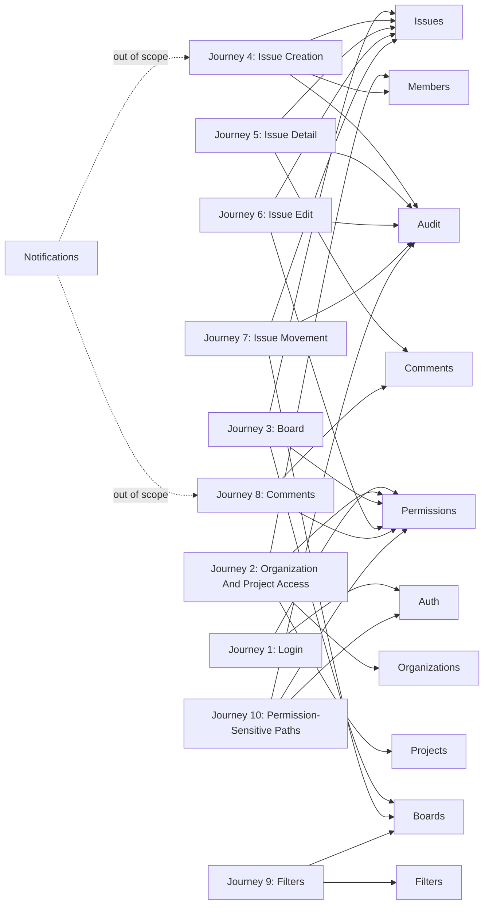

# OpenJira Functional Requirements Matrix

Card: OJ-008 - Define functional requirements by domain  
Epic: OJ-E03 - Requirements  
Owner: Helena Duarte  
Role: Requirements  
Status: evidence for TechLead review  
Source journeys: `docs/requirements/core-user-journeys.md`  
Source backlog: `docs/product/mvp-backlog.md`  
Last updated: 2026-07-02

## Purpose

Define verifiable functional requirements by domain for the OpenJira MVP. This matrix converts the approved core user journeys into requirements that can feed acceptance criteria, RBAC, API contract, and database modeling work.

## Scope Rules

- MVP requirements are required for the first executable OpenJira product scope.
- Post-MVP requirements are intentionally deferred and must not block the MVP unless a later card changes scope.
- Notifications are explicitly out of scope for the MVP.
- Backend enforcement, data persistence, and API design remain owned by their downstream cards, but this document defines the functional behavior those cards must cover.

## Downstream Inputs

| Downstream card | Input from this matrix |
| --- | --- |
| OJ-009 - Define acceptance criteria for MVP flows | All MVP rows provide acceptance-test targets, good path expectations, bad path expectations, empty states, validation failures, and permission failures. |
| OJ-012 - Define auth and RBAC strategy | Auth, Members, Permissions, and permission-sensitive requirements define roles, access boundaries, denied-action behavior, and backend enforcement expectations. |
| OJ-BE-001 - Define REST API contract for MVP | All MVP rows define endpoint behavior, response safety, validation behavior, filtering behavior, and error cases that the REST contract must expose. |
| OJ-013 - Design initial PostgreSQL model | Organizations, Members, Projects, Boards, Issues, Comments, Filters, Permissions, and Audit rows identify core entities, relationships, audit history, and tenant isolation requirements. |

## Traceability

## MVP Functional Requirements

| Domain | Requirement ID | Requirement statement | Priority | MVP or post-MVP classification | Impacted roles | Impacted screens | Related journey | Verification notes |
| --- | --- | --- | --- | --- | --- | --- | --- | --- |
| Auth | OJ-FR-AUTH-001 | The system must require an authenticated session before granting access to organization, project, board, issue, comment, filter, member, permission, or audit screens. | P0 | MVP | Anonymous visitor, organization member, project member, project admin, organization admin | Login, organization selection, project selection, board, issue detail | Journey 1, Journey 10 | Verify protected routes reject anonymous access and route to login or return an authorization response without protected data. |
| Auth | OJ-FR-AUTH-002 | The system must authenticate a user with valid credentials and create an active session that can be used by protected MVP screens. | P0 | MVP | Anonymous visitor | Login | Journey 1 | Verify valid credentials redirect to the first accessible organization or organization selection. |
| Auth | OJ-FR-AUTH-003 | The system must reject invalid credentials with a generic login error that does not identify whether email, username, password, or account status failed. | P0 | MVP | Anonymous visitor | Login | Journey 1 | Verify invalid login remains on the login screen and exposes no credential-specific failure reason. |
| Organizations | OJ-FR-ORG-001 | The system must list only organizations where the authenticated user has membership or explicit access. | P0 | MVP | Organization member, organization admin | Organization selection | Journey 2, Journey 10 | Verify inaccessible organization names, counts, and metadata are not returned or rendered. |
| Organizations | OJ-FR-ORG-002 | The system must show a no-access empty state when an authenticated user has zero accessible organizations. | P0 | MVP | Organization member | Organization selection | Journey 2 | Verify the empty state appears without listing restricted organizations. |
| Members | OJ-FR-MEM-001 | The system must use organization and project membership to determine which projects, boards, issues, comments, and filters a user can access. | P0 | MVP | Organization member, project member, project admin, organization admin | Organization selection, project selection, board, issue detail | Journey 2, Journey 10 | Verify membership boundaries are applied before data is listed or opened. |
| Members | OJ-FR-MEM-002 | The system must limit issue assignee options to eligible members of the selected project. | P0 | MVP | Issue reporter, project member, project admin | Issue create, issue edit | Journey 4, Journey 6 | Verify users outside the project cannot be selected as assignees. |
| Projects | OJ-FR-PROJ-001 | The system must list only projects available to the authenticated user inside the selected organization. | P0 | MVP | Organization member, project member, project admin | Project selection | Journey 2 | Verify restricted project names and metadata are not returned or rendered. |
| Projects | OJ-FR-PROJ-002 | The system must show a no-access empty state when the selected organization has no projects available to the authenticated user. | P0 | MVP | Organization member | Project selection | Journey 2 | Verify the empty state appears without showing restricted project data. |
| Projects | OJ-FR-PROJ-003 | The system must block direct URL access to a restricted project without exposing project details. | P0 | MVP | Organization member, project member | Project selection, board | Journey 2, Journey 10 | Verify direct access returns an authorization-safe failure and no restricted payload. |
| Boards | OJ-FR-BRD-001 | The system must provide one board for each MVP project. | P0 | MVP | Project member, project admin | Board | Journey 3 | Verify opening an accessible MVP project loads exactly one project board context. |
| Boards | OJ-FR-BRD-002 | The system must show board workflow columns for the selected project and place each visible issue in its current column. | P0 | MVP | Project member, project admin | Board | Journey 3 | Verify issue cards render under the persisted column and do not appear in multiple columns. |
| Boards | OJ-FR-BRD-003 | The board must show issue type, title, priority, assignee, and status for each visible issue card. | P0 | MVP | Project member, project admin | Board | Journey 3 | Verify each card renders those fields when the user has issue access. |
| Boards | OJ-FR-BRD-004 | The board must show an empty state when the accessible project has no visible issues. | P1 | MVP | Project member, project admin | Board | Journey 3 | Verify create access remains available from the empty state when permissions allow issue creation. |
| Boards | OJ-FR-BRD-005 | The board must show a recoverable error state when board data cannot be loaded. | P1 | MVP | Project member, project admin | Board | Journey 3 | Verify the error state does not present stale or restricted data as complete. |
| Boards | OJ-FR-BRD-006 | The system must allow a permitted user to move an issue to another column in the same project board. | P0 | MVP | Project member, issue assignee, project admin | Board, issue detail | Journey 7 | Verify valid movement persists the new column and refreshes the board. |
| Boards | OJ-FR-BRD-007 | The system must reject invalid or stale issue movements and restore the issue to its last persisted column. | P0 | MVP | Project member, issue assignee, project admin | Board | Journey 7 | Verify invalid target columns, stale state, and permission failures do not create duplicate cards. |
| Issues | OJ-FR-ISS-001 | The system must allow a permitted project member to create an issue in an accessible project. | P0 | MVP | Issue reporter, project member, project admin | Board, issue create | Journey 4 | Verify a valid issue is created in the initial workflow column and appears on the board. |
| Issues | OJ-FR-ISS-002 | Issue creation must require all required fields and reject missing or invalid required fields with field-level validation errors. | P0 | MVP | Issue reporter, project member, project admin | Issue create | Journey 4 | Verify invalid submissions preserve safe user-entered values and create no partial issue. |
| Issues | OJ-FR-ISS-003 | Issue creation must support optional type, priority, assignee, and description fields. | P0 | MVP | Issue reporter, project member, project admin | Issue create | Journey 4 | Verify optional fields persist when valid and may be omitted when not required by downstream rules. |
| Issues | OJ-FR-ISS-004 | The system must show issue title, description, type, priority, status, reporter, assignee, comments, and basic history on issue detail for an accessible issue. | P0 | MVP | Project member, issue reporter, issue assignee, project admin | Issue detail | Journey 5 | Verify all listed fields render for a user with access. |
| Issues | OJ-FR-ISS-005 | The system must show a not found state when an issue does not exist. | P0 | MVP | Project member | Issue detail | Journey 5 | Verify nonexistent issue access creates no placeholder data. |
| Issues | OJ-FR-ISS-006 | The system must block access to an existing issue in a restricted project without revealing issue details. | P0 | MVP | Organization member, project member | Issue detail | Journey 5, Journey 10 | Verify restricted issue title, comments, history, and metadata are not returned or rendered. |
| Issues | OJ-FR-ISS-007 | The system must allow a permitted user to edit allowed issue fields and persist valid changes. | P0 | MVP | Issue reporter, issue assignee, project member with edit permission, project admin | Issue detail, issue edit, board | Journey 6 | Verify saved changes update issue detail and board summary. |
| Issues | OJ-FR-ISS-008 | The system must reject invalid issue updates with field-level validation errors and leave the previous persisted issue unchanged. | P0 | MVP | Issue reporter, issue assignee, project member with edit permission, project admin | Issue edit | Journey 6 | Verify invalid updates do not modify persisted fields. |
| Issues | OJ-FR-ISS-009 | The system must reject issue creation, editing, or movement when the user lacks the required permission. | P0 | MVP | Project member, issue reporter, issue assignee, project admin | Board, issue create, issue detail, issue edit | Journey 4, Journey 6, Journey 7, Journey 10 | Verify unauthorized actions either hide controls or return authorization-safe errors and create no changes. |
| Comments | OJ-FR-COM-001 | The system must allow a permitted project member to add a comment to an accessible issue. | P0 | MVP | Project member, issue reporter, issue assignee, project admin | Issue detail | Journey 8 | Verify a valid comment is saved and shown on the issue. |
| Comments | OJ-FR-COM-002 | Comment creation must reject empty or invalid content with validation feedback and must not create a blank comment. | P0 | MVP | Project member, issue reporter, issue assignee, project admin | Issue detail | Journey 8 | Verify invalid comment submissions create no comment record. |
| Comments | OJ-FR-COM-003 | Comments must show author and creation time and must follow the same visibility boundary as the issue. | P0 | MVP | Project member, issue reporter, issue assignee, project admin | Issue detail | Journey 5, Journey 8 | Verify restricted issue comments are not returned or rendered to unauthorized users. |
| Filters | OJ-FR-FLT-001 | The system must allow a project member to filter board issues by status or column, assignee, priority, issue type, and text search by issue key or title. | P0 | MVP | Project member, project admin | Board | Journey 9 | Verify each supported filter narrows only visible project issues. |
| Filters | OJ-FR-FLT-002 | The system must show matching filtered issues grouped by board column. | P0 | MVP | Project member, project admin | Board | Journey 9 | Verify filtered results preserve column grouping. |
| Filters | OJ-FR-FLT-003 | The system must allow the user to clear filters and restore the default board view. | P1 | MVP | Project member, project admin | Board | Journey 9 | Verify clearing filters restores all visible issues for the project board. |
| Filters | OJ-FR-FLT-004 | The system must show an empty filtered state when no visible issues match the active filters. | P1 | MVP | Project member, project admin | Board | Journey 9 | Verify the empty filtered state includes a path to clear filters. |
| Filters | OJ-FR-FLT-005 | The system must ignore unsupported filter input or return validation feedback without breaking the board view. | P1 | MVP | Project member, project admin | Board | Journey 9 | Verify unsupported filters do not reveal restricted counts or metadata. |
| Permissions | OJ-FR-PER-001 | The system must verify authentication and authorization before listing or mutating organizations, projects, boards, issues, comments, filters, memberships, roles, or audit history. | P0 | MVP | Anonymous visitor, organization member, project member, project admin, organization admin | All protected MVP screens | Journey 10 | Verify authorization is enforced server-side for protected reads and writes. |
| Permissions | OJ-FR-PER-002 | Permission failures must use authorization-safe messages and must not reveal restricted organization names, project names, issue titles, comments, counts, or metadata. | P0 | MVP | Anonymous visitor, organization member, project member | Login, organization selection, project selection, board, issue detail | Journey 2, Journey 3, Journey 5, Journey 8, Journey 9, Journey 10 | Verify denied responses and screens contain no restricted identifiers or aggregate counts. |
| Permissions | OJ-FR-PER-003 | Board, issue, comment, and filter actions must be limited by project permissions. | P0 | MVP | Project member, issue reporter, issue assignee, project admin | Board, issue create, issue detail, issue edit | Journey 3, Journey 4, Journey 6, Journey 7, Journey 8, Journey 9 | Verify users without action permission cannot perform the action through UI or API. |
| Permissions | OJ-FR-PER-004 | Admin-level organization and project membership operations must require an organization admin or project admin role according to the RBAC strategy. | P0 | MVP | Project admin, organization admin | Member administration, project settings, organization settings | Journey 10 | OJ-012 must define the final role matrix; verify non-admin users cannot perform membership or role administration. |
| Audit | OJ-FR-AUD-001 | The system must record basic history when an issue is created, edited, or moved. | P0 | MVP | Issue reporter, issue assignee, project member, project admin | Issue detail, board | Journey 4, Journey 6, Journey 7 | Verify history identifies the actor, action, affected issue, changed field or movement, and timestamp. |
| Audit | OJ-FR-AUD-002 | Issue detail must show basic history for the accessible issue. | P1 | MVP | Project member, issue reporter, issue assignee, project admin | Issue detail | Journey 5, Journey 6, Journey 7 | Verify history visibility follows issue access boundaries. |
| Audit | OJ-FR-AUD-003 | The system must preserve comment author and creation time as immutable comment history fields. | P0 | MVP | Project member, issue reporter, issue assignee, project admin | Issue detail | Journey 8 | Verify author and creation time do not change after comment creation. |

## Post-MVP And Out-Of-Scope Requirements

| Domain | Requirement ID | Requirement statement | Priority | MVP or post-MVP classification | Impacted roles | Impacted screens | Related journey | Verification notes |
| --- | --- | --- | --- | --- | --- | --- | --- | --- |
| Auth | OJ-FR-AUTH-101 | The system may support account recovery, password reset, invitation acceptance, and multi-factor authentication after MVP. | P2 | Post-MVP | Anonymous visitor, organization member | Login, account recovery | Journey 1 | Verify no MVP acceptance criteria or API contract depends on these flows. |
| Organizations | OJ-FR-ORG-101 | The system may support self-service organization creation and organization profile management after MVP. | P2 | Post-MVP | Organization admin | Organization settings | Journey 2 | Verify MVP only requires listing accessible organizations. |
| Members | OJ-FR-MEM-101 | The system may support full member invitation, removal, role editing, and deactivation workflows after MVP. | P2 | Post-MVP | Organization admin, project admin | Member administration | Journey 10 | Verify MVP RBAC covers enforcement; full administration UX can be deferred. |
| Projects | OJ-FR-PROJ-101 | The system may support project creation, project archival, project settings, and cross-project navigation after MVP. | P2 | Post-MVP | Organization admin, project admin | Project settings, project selection | Journey 2 | Verify MVP only requires opening accessible existing projects. |
| Boards | OJ-FR-BRD-101 | The system may support configurable workflows, custom columns, swimlanes, WIP limits, and multiple boards per project after MVP. | P2 | Post-MVP | Project admin, project member | Board, project settings | Journey 3, Journey 7 | Verify MVP assumes one board and a small Kanban workflow. |
| Issues | OJ-FR-ISS-101 | The system may support attachments, labels, subtasks, linked issues, estimates, due dates, and advanced issue templates after MVP. | P2 | Post-MVP | Project member, project admin | Issue create, issue detail, issue edit | Journey 4, Journey 5, Journey 6 | Verify MVP issue fields remain limited to fields listed in MVP requirements. |
| Comments | OJ-FR-COM-101 | The system may support comment editing, deletion, reactions, mentions, rich text, and threaded replies after MVP. | P2 | Post-MVP | Project member, project admin | Issue detail | Journey 8 | Verify MVP only requires create, validate, list, author, and creation time. |
| Filters | OJ-FR-FLT-101 | The system may support saved filters, shared filters, advanced search syntax, sorting presets, and global search after MVP. | P2 | Post-MVP | Project member, project admin | Board, search | Journey 9 | Verify MVP only requires project-board scoped basic filters. |
| Permissions | OJ-FR-PER-101 | The system may support custom permission schemes, field-level permissions, and temporary access grants after MVP. | P2 | Post-MVP | Organization admin, project admin | Organization settings, project settings | Journey 10 | Verify MVP RBAC strategy covers minimum roles and action enforcement. |
| Audit | OJ-FR-AUD-101 | The system may support exportable audit logs, retention policies, actor impersonation records, and compliance reporting after MVP. | P2 | Post-MVP | Organization admin, project admin | Audit log, organization settings | Journey 10 | Verify MVP only requires issue history and immutable comment author/timestamp fields. |
| Notifications out of scope | OJ-FR-NOT-001 | The system must not require email, in-app, push, Slack, webhook, or mention notifications for MVP delivery. | P2 | Out of scope | Organization member, project member, issue reporter, issue assignee, project admin, organization admin | None for MVP | Journey 4, Journey 6, Journey 7, Journey 8 | Verify no MVP acceptance criteria, API endpoint, database model, or UI screen requires notification delivery. |
| Notifications out of scope | OJ-FR-NOT-002 | The system may define notification requirements only after MVP scope is reopened by a future backlog card. | P2 | Out of scope | Organization member, project member, issue reporter, issue assignee, project admin, organization admin | Future notification settings | Journey 8, Journey 10 | Verify notification behavior remains excluded from OJ-009, OJ-BE-001, and OJ-013 MVP outputs. |

## Domain Handoff Notes

### OJ-009 Acceptance Criteria

OJ-009 should convert every MVP requirement into acceptance criteria with explicit pass and fail states. Required focus areas are login success and failure, no organization access, no project access, board load and empty states, issue create/detail/edit/move, comment create and validation, filter apply/clear/empty/invalid input, and permission failures without restricted data leakage.

### OJ-012 Auth And RBAC Strategy

OJ-012 should define the final permission matrix for `org_admin`, `project_admin`, `member`, and `viewer`, unless an ADR changes the role set. It must map each protected read or write action in the MVP matrix to a backend-enforced authorization rule.

### OJ-BE-001 REST API Contract

OJ-BE-001 should define endpoints and DTOs for auth, organizations, members, projects, boards, columns, issues, comments, issue history, and filters. Each endpoint must declare authentication requirements, authorization requirements, validation errors, safe not-found behavior, and the standard error response.

### OJ-013 PostgreSQL Model

OJ-013 should model users, organizations, memberships, projects, boards, board columns, issues, comments, and issue history. The model must support tenant isolation, project membership boundaries, issue movement history, comment author and creation time, and safe filtering on visible project issues.

## Review Notes For TechLead

Dependencies satisfied:

- OJ-007 evidence exists at `docs/requirements/core-user-journeys.md`.
- The matrix covers Auth, Organizations, Members, Projects, Boards, Issues, Comments, Filters, Permissions, Audit, and Notifications out of scope.
- MVP and post-MVP/out-of-scope items are separated.
- Each row includes domain, requirement ID, statement, priority, classification, impacted roles, impacted screens, related journey, and verification notes.

Dependencies created:

- OJ-009 can derive acceptance criteria from the MVP rows.
- OJ-012 can derive RBAC actions and permission boundaries from Auth, Members, Permissions, and permission-sensitive rows.
- OJ-BE-001 can derive REST endpoint behavior from MVP rows.
- OJ-013 can derive entity, relationship, and audit modeling needs from MVP rows.

Readiness assessment:

- OJ-008 has produced the required Markdown evidence.
- The document is requirements-only and does not change product card status.
- No source file used by the docs portal was changed by this evidence.
